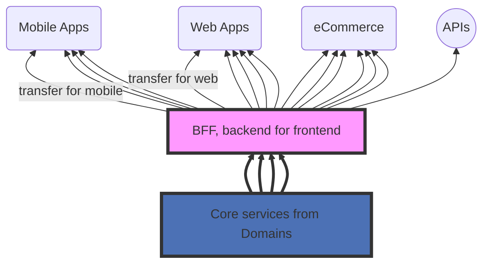
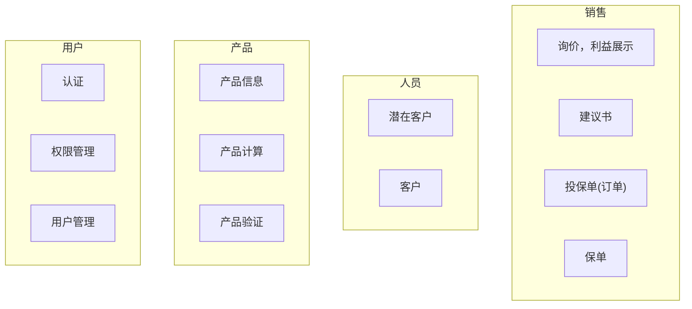

<!-- toc orderedList:0 depthFrom:2 depthTo:4 -->

* [基本思路](#基本思路)
  * [目标](#目标)
  * [ebaocloud架构总体设计](#ebaocloud架构总体设计)
    * [PaaS和SaaS层分离](#paas和saas层分离)
    * [云架构和微服务](#云架构和微服务)
* [建立基于公有云的微服务架构](#建立基于公有云的微服务架构)
  * [API分层](#api分层)
  * [API设计](#api设计)
    * [API设计目的](#api设计目的)
    * [API命名规则](#api命名规则)
    * [GET|POST|PUT|DELELE 服务](#getpostputdelele-服务)
    * [幂等](#幂等)
    * [对象模型](#对象模型)
    * [需要特别注意的问题](#需要特别注意的问题)
  * [业务域](#业务域)
    * [产品域（product）](#产品域product)
    * [准客户域](#准客户域)
    * [销售域（TBD）](#销售域tbd)
  * [用户使用](#用户使用)
  * [参考](#参考)

<!-- tocstop -->


ebaocloud LI 架构和设计规范
================
## 基本思路
建立ebaocloud的根本目的和目标，是为了建设一个全行业的基础服务平台，提供保险业的基础服务能力，并且连接行业参与方，赋能行业参与方。同时，在满足安全、稳定、高效等前提下，平台会以极具竞争力的价格提供所有服务。
因此ebaocloud必须有能力以平台（PaaS）模式，而不仅仅是（SaaS）应用模式工作，这个会对整体架构和开发、发布、运维模式造成非常大的影响。

### 目标
需要强调的是，这些目标的实现也是有步骤的，按照优先级别，不断完善的过程。分为1.5，5和9个月三个阶段
|        业务和技术目标        |                               1.5个月                                |                                           5个月                                            |                                           9个月                                            |
| ---------------------------- | -------------------------------------------------------------------- | ------------------------------------------------------------------------------------------ | ------------------------------------------------------------------------------------------ |
| 租户数量 / 业务量 / 使用模式 | 6-10、并发80-100、60% E2E方案，40% API                               | > 20。并发200-300。40% E2E方案，60% API。                                                  | > 60。并发1000。大部分都是API使用者                                                        |
| 多租户 |初级版多租户方案，并且需要将老客户逐步转入多租户方案| 完整版多租户方案，同时要有相对应的快速建租户功能（脚本，UI）| 租户具备一定的自我管理能力——admin portal，包括配置，监控等，ebaocloud重心转向工单支持，电话支持|
| 高可用，高性能，高可靠       | 具备水平扩展能力（手工），应用层面承担绝大多数负荷，剥离数据库负荷。 | 自动水平扩展（弹性伸缩），系统监控，健康检查和自动预警，报警。相应的服务支持幂等操作       | 微服务体系初步具备，每个域都能够按需进行弹性伸缩。建立初步的熔断机制，延迟跟踪，日志分析。 |
| API                          | API部分具备对外公开能力，从产品计算的API开始，逐步再开放其他域       | E2E客户，主要靠外包和第三方团队，完成项目实施。初步形成API配套文档，案例，建立沙箱测试环境 |                                                                                            |
| 运维                         | 手工运维，开发一些自动化脚本                                         | 多环境运维能力建立（阿里云，AWS，第三方云环境），建立初步的DevOps能力                      |                                                                                            |

架构上中远期目标，是要建立起一个多租户，高性能，具备弹性水平扩展能力，同时具备熔断、降级能力的高可用平台，能够支撑1000并发用户。同时，初步实现自动化测试和运维。

### ebaocloud架构总体设计
- #### PaaS和SaaS层分离
如下图所示，eBaoCloud会严格按照PaaS和SaaS隔离的架构模式构建，基础服务和组件，都会在PaaS层提供，并且是完全基于API的方式提供。该层是eBaoCloud的核心功能，原则上所有功能都会由eBao提供。PaaS层，也会按照功能分成基础服务和应用服务，应用服务层会提供更加广泛和灵活的API，以满足SaaS层的需求。
SaaS上面更加多的体现多样性，各种类型的应用，以及各种应用的组合可以形成一定的行业的解决方案。SaaS的远期目标是，大部分应用都是有第三方ISV提供，并且持续为客户提供后续的维护和服务。

云平台作为一个整体也会对外输出API，供外部应用直接使用，这些应用既可以安装在公有云上，也可以安装在企业的私有云上，他们通过接口使用eBaoCloud所提供的能力。eBaoCloud对外提供的API将会少于内部所使用的API。

- #### 云架构和微服务
易保云的PaaS层，长远目标将是建立一个基于微服务的稳定的基础平台，逐步将业务和流程逻辑剥离出去，TODO: 微服务架构

## 建立基于公有云的微服务架构
基于建立平台的大目标，我们需要逐步建立起相对于的基于公有云的微服务架构体系，同时因为不是从零做起，我们需要找到从现有系统和架构演化到新架构体系之路。

其中API和微服务化是关键步骤，也是否系统平稳的运行在云上，为大规模客户提供服务的基础。

### API分层
BFF(backend for frontend)是API分层的核心，BFF层会承担多重任务
1. 针对不同前端实现和应用的定制化API和API裁剪
2. 对象模型的裁剪
3. API调用组合
4. TBD...


核心层API需要做到非常的通用以及和UI无关，有足够的灵活性。
### API设计
- #### API设计目的

API是平台对外提供服务能力的载体，ebaocloud以 Restful 的形式设计所有的对外API，体现ebaocloud作为一个公共资源所能够对外提供的服务能力。支持GET, PUT, POST 和 DEL四种操作。

- #### API命名规则
  - URL采用如下结构（请参考后面的例子）： `[GET|POST|PUT|DELELE] http(s)://domainURL/version/tenantId/domain/resources/resources`
    - version 目前是v1
    - tenantId 用来区分租户
    - domain 需要严格按照确定的域名称
    - resource部分原则上不应该加入任何动词，而只应该有资源名称和层级。
- #### GET|POST|PUT|DELELE 服务
  - **GET**: 获取资源，如果把ebaocloud当成一个公共资源，所有GET操作都是资源获取。GET操作就是获取信息：产品信息，客户信息，建议书信息 ...，
    - ` GET /products/ ` ：获取产品列表
    - ` GET /products/hot;  GET /products/recent ` ：获取热门、最新产品列表
    - ` GET /products/productId ` ：获取某一个产品信息
    - ` GET /prospects/prospectId` ：获取某一个prospect
    - ` GET /prospects/prospectId/proposals`：获取某一个prospect下的所有proposal
    - ` GET /proposals/proposalId` ：获取某一个proposal，尽可能采用最短路径，而不是 `GET /prospects/prospectId/proposals/proposalId`
  - **POST**：创建资源
    - ` POST /prospects`：创建一个新的prospect，一般需要返回prospect的id信息
    - ` POST /proposals`：创建一个新的proposal
  - **PUT**：创建或者更新资源，和POST不同的是，PUT必须是幂等的，因此在使用PUT前，必须确定资源的id
    - ` PUT /prospects/prospectId` 创建或者修改某prospect
    - ` PUT /proposals/proposalId` 创建或者修改某proposal
  - **DELETE**：删除资源，DELETE必须是幂等的
    - ` DELETE /prospects/prospectId` 删除某prospect
    - ` DELETE /proposals/proposalId` 删除某proposal
  - 复杂查询和保费（包括其他费）计算，严格讲都是GET操作，但因为都需要传如大量参数，可以用POST。
    - ` POST /products/calculator/premium `
    - ` POST /products/query `
    - ` POST /products/calculator/validation `
  - Request (TBD)，需要加入auth信息，租户信息
  - Response (TBD)
- #### 幂等
  - 所有服务都要确保幂等
  - POST 请求需要考虑技术层面的幂等处理，接口中要包括租户Id + requestId作为幂等控制项。
  - TBD后续持续补充
- #### 对象模型
  - 
- #### 需要特别注意的问题
  - 如果从用户角度看，用户是需要获取ebaocloud的计算、连接能力，当然也包括数据（产品库，规则库），因此用户并不关心后台的具体实现，而只关心最后的结果。API设计上要尽可能考虑用户的使用。
  - 用户可以选择部分或者全部使用ebaocloud，或者换而言之，我们并不需要提供所有的功能，满足所有的需求，而是可以逐步渐进的提供。ebaocloud还没有提供的服务，需要客户在本地实现，或者有其他第三方供应商实现。


### 业务域
目前易保系统已经基本定义了明确的业务域，也在有效的运作，需要做的事情就是在现有的域基础上，按照微服务的架构思想进行不断的改造。在一个域内，可以考虑继续做分割。
目标是要建成独立的，边际清晰的子系统，系统对外部的依赖降到最低，并且不感知上游系统个性化请求。

核心业务域，暂定为4个：用户，产品，人员（party）和销售，其中用户域会逐步和外部框架（From Frank Xing）融合并且剥离。
非核心业务域：待定。



- #### 产品域（product）
  - 产品域是核心功能，围绕保险产品，提供了相关能力：产品信息获取，产品计算，产品基础校验
  - 产品域的特点是，几乎所有功能都可以通过GET方法提供，同时产品域需要提供“无限”的动态水平扩展能力
  - 产品域要求能够做到自动化测试、独立部署，高可用和高性能
  - 现在的产品域依然很大，建议再做逐步的拆分

  ``` mermaid
  graph BT
  F["产品导入导出 (Deployment)"] --> P(("产品数据 - File"))
  E["产品配置 - UI (Design Time)"] --> P(("产品数据 - File"))
  P(("产品数据 - File")) --> A["产品信息获取（基本信息，Limits...）- Cache"]
  P(("产品数据 - File")) --> B["产品计算 - Cache + CPU"]
  P(("产品数据 - File")) --> C["Validation -  Cache + CPU"]

  A["产品信息获取（基本信息，Limits...）- Cache"] --> A1[个性化产品信息获取]
  B["产品计算 - Cache + CPU"] --> B1[个性化产品计算]
  C["Validation -  Cache + CPU"] --> C1[个性化validation]


  classDef BFF fill:#f9f,stroke:#333,stroke-width:4px;
  class A1,B1,C1 BFF;
  classDef core fill:#4C71B5,stroke:#333,stroke-width:4px;
  class A,B,C core;
  ```


- #### 准客户域
  准客户域的功能比较简单，独立的准客户域即可。

- #### 销售域（TBD）


### 用户使用

### 参考
[我所认为的RESTful API最佳实践](http://www.scienjus.com/my-restful-api-best-practices/)
[理解RESTful架构](http://www.ruanyifeng.com/blog/2011/09/restful.html)
[微服务本身也是架构演化的结果](http://www.open-open.com/lib/view/open1460209702222.html)
