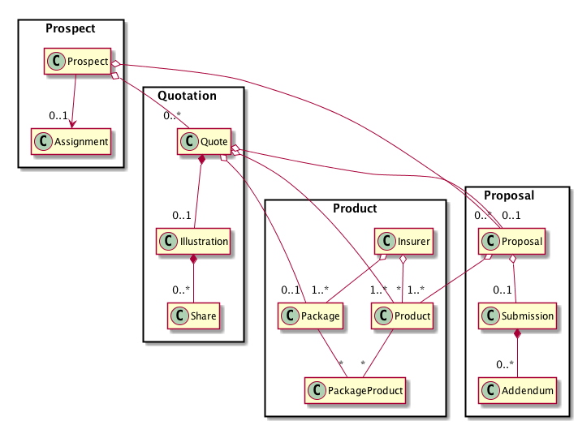

## Change History
| Date    | Author    | Version    | Description                         |
|---------|-----------|------------|-------------------------------------|
| Mar 13 2017 | eBao - PBU Life  | 0.0.1     | Initial version
| Mar 22 2017 | eBao - PBU Life  | 0.0.2     | Separate wiki pages
| Mar 27 2017 | eBao - PBU Life  | 0.0.3     | Include Insurer, Proposer in
| Apr 03 2017 | eBao - PBU Life  | 0.0.4     | Add Quotation, update to Product, Prospect

Product domain

### <a name="intro">1.0 Introduction   </a>

The proposed eBao Cloud services for life insurance have been documented using the OpenApi Specification (aka Swagger). However, the listing of the available services by themselves can be hard to understand by itself, as it does not have the context on how the services should be used. Hence, a more practical approach would be to demonstrate how the services could be used when building front-end client applications.  

Given the above, the objective of this document is to explore the various scenarios in which the services can be leveraged to build front-end client applications quicker. The currently available services are targeted at the sales cycle for life insurance products.

There are a number of activities in the insurance product sales cycle and the services are organized along the same lines.   
 * Contact / Prospect  
 * Fact Find (Financial Needs Analysis aka FNA
 * Quotation
 * Proposal
 * Submission

To support these activities, there are a number of primary business objects, namely:

 * Prospect

   Customer that is purchasing life insurance
    
 * Insurer

   The company that is "manufacturing" the life insurance product
    
 * Package

   This represents a sales package which is a bundle of products that are designed to be sold together.
    

 * Product

   This refers to the insurance product.
    

 * FNA

   Financial Needs Analysis is the process whereby an intermediary will discuss the various needs of the customer, so as to find the best product fit for the customer.
    

 * Quote

   A quote is a document with details of proposal insurance. Includes information about the life assureds, the main product, riders, top-ups, withdrawals, and fund allocations. This information is used to generate a illustration containing the table of benefits that the customer will receive if they purchase the proposed insurance.
    

 * Proposal
   An application to the insurer for a new policy. It contains details of the proposed insurance, the personal information about the policyholder, life assured and optionally the beneficiaries. It also contains the health declaration of the proposal and life assured. It also carries the customer signatures together with the agent's signature to signify intent to purchase the proposed insurance.
    

 * Submission

   This refers to the electronic submission of the proposal and supporting addendums to the insurer.

At the present time, we are excluding Activity Tracking as it is deemed that this is not insurance specific and the application developers can use other solutions.

These common business objects form the core resources in the eBaoTech Cloud APIs.

### <a name="assumptions">2.0 Assumptions & Constraints</a>

It is assumed that tied agents or brokers will use the applications built. In addition, these applications are targeted at the desktop browsers as well as mobile web applications or mobile applications.

### <a name="prospects">3.0 Domains</a>

The eBaoTech Cloud services are organized by domains. The domains are:

* Prospect
* Product
* Quotation
* Proposal
* Financial Needs Analysis

Please refer to the [specification](http://swagger.ebaocloud.life) for the available services under each of the domains.

The following is a diagram of the various domains with their respective resources that they manage.

The purpose of this document is to supplement the eBaoTech Cloud API specifications, i.e. for the purpose of making it easier to understand how the API services can be used. The APIs are designed to help in the building of front end applications that are targeted at the life insurance sales process.

To aid in the understanding of the available APIs, we will discuss example use cases. For each of the domains, we will discuss one or more use cases, and for each use case, we will highlight how the eBaoTech Cloud APIs are used to accomplish the required task. Sequence diagrams serve as a useful tool to demonstrate the calls to the APIs. Where appropriate, sample mock up screens are also used to help provide context for the discussions.

The follow the following links for the discussion on the various use cases.

* [Prospect](https://github.com/yitchoong/cloudapi/wiki/Prospect)
* [Product](https://github.com/yitchoong/cloudapi/wiki/Product)
* [Quotation](https://github.com/yitchoong/cloudapi/wiki/Quotation)
* [Proposal](https://github.com/yitchoong/cloudapi/wiki/Proposal)
* [Needs Analysis](https://github.com/yitchoong/cloudapi/wiki/FNA)
