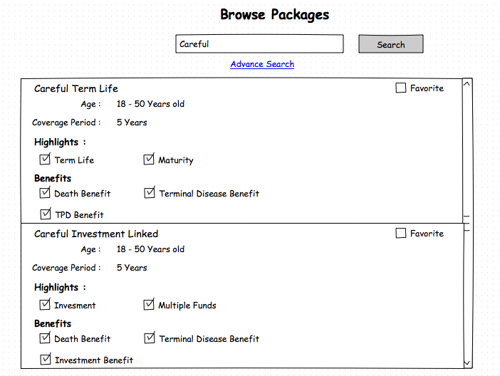
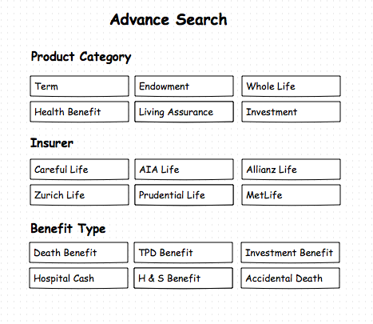
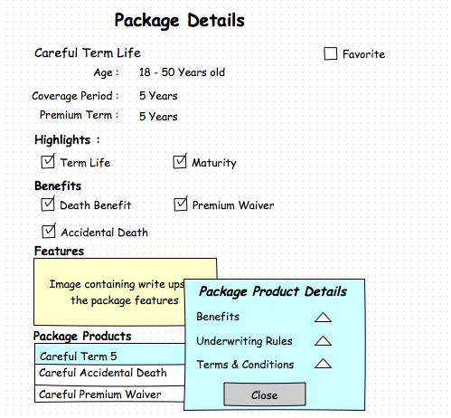
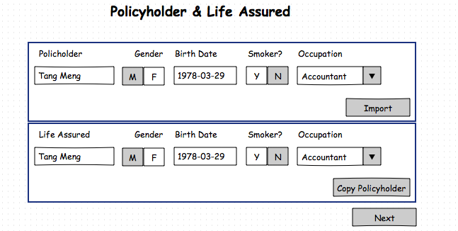
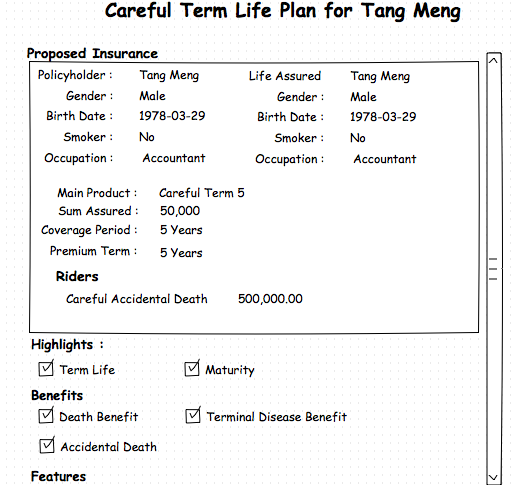
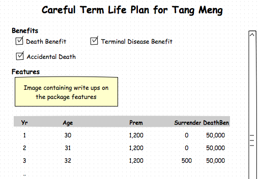

## <a >Product Domain</a>

The product domain services are designed to provide information about the products, the packages and insurers. These are the three primary resources that are available from the product domain and are defined using the eBaoTech Product Factory.  

Packages a way to bundle a set of products together for the purposes of distribution, i.e. these are a set of products that make sense together. Packages will typically contain one main product plus a number of rider products. A useful analogy would be when selling a car (main product), there can be a number of accessories that are bundled together (rider products). To aid in the selling process, the package will contain information about the product features highlights, obligations, and benefits.

The product resource is the focus of the product domain. Apart from common attributes like product name, expiry date, etc, there are also product attributes that are relate to limits (constraints) and rates used in the various validation and calculation rules. Instead of exposing these as raw attributes to clients, these limits and rates and used in validators and calculators for the product. These validators and calculator services are designed to support the quotation process in the sales cycle. As life insurance is a virtual product, customers are not able to touch and feel the product that they are buying. To alleviate this issue, it is common that one of the main objectives of the quotation process is to derive an illustration to demonstrate the benefits that the customer will enjoy when he/she buys the product.

In order to derive the illustration, two things are required:

(a) The product specification
(b) Details of the proposed insurance

* ##### Product Specification #####

  The product specification is defined using the eBaoTech Product Factory. There are many product attributes that can be defined in the product factory. Before we look at the various product attributes, let us take a step back and consider characteristics of life insurance products. These products can be considered as complex instruments that are designed to serve three purposes, i.e.

  * Protection
  * Savings
  * Investment

  There are some products (Term) which only has the protection component. Other products like Endowment products have both the protection and savings components. Yet others (ILP products) have the protection and investment components. Generally, products that have protection only or protection plus savings are classified as traditional products. Products with the investment components are classified as investment products.

  Life insurance products will have a protection element, i.e. the protection of the insured object against loss. In this case, the insured object is always a person, and the protection can be against different types of calamities. The common things that life insurance protects against are losses, in the event of death, permanent disabilities, critical illnesses, hospitalization,  and others types of losses. Different products are designed to protect against different kinds of losses. In defining a product in the product factory, the number of product attributes that have to be defined will depend on the type of protection the product is targeted at, as well as whether it has the savings or investment components.

  Using the eBaoTech product factory, there are many product attributes that can be defined including, including the limits used for validation (age limits), and rates (premium rates, bonus rates) used by the calculation formulas (e.g. premium calculations, charges etc). In setting up the product attributes in the eBaoTech product factory, there is also the concept of main products versus rider products. As mentioned earlier, a good analogy is that of buying a car. The base car is the main product and it is normally sold with both mandatory and recommended accessories. As an example, air-conditioning may be a mandatory accessory but leather seats are optional. Similarly, in life insurance, riders can be mandatory or optional.

  Apart from the product attributes, the product factory also allows for the definition of relationships between the products, specifically the relationship between main and rider products as well as relationships between riders. The relationships are also the basis for packages.

  To continue with the car analogy, a spoiler kit may only be applicable to sedan models. Additionally, the customer may have a choice of the  "premium spoiler kit" or the "basic spoiler kit". Since, a car can only have one spoiler kit, they are mutually exclusive. In our context, main products have a list of attachable riders. For example, some riders are only attachable to investment linked products (e.g. unit deduction riders). In a similar fashion to spoiler kits, there are also riders that have mutually exclusive relationships, e.g. only one waiver premium rider can be attached.

  Once the product definitions are completed in the product factory, the product can be tested before being loaded directly onto the cloud platform.

* ##### Proposed Insurance Details #####

  For the proposed insurance, the amount of details can vary depending on the product. For example, if a customer wished to buy an investment product, fund allocation details will be required whereas fund allocation details does not apply to traditional products. Additionally, information requirement for the main and rider products can also differ. For example, product-a may require the sum assured whilst product-b may require the benefit plan instead. This can present a challenge to the front end application as the input fields are dynamic and depending on the product (both main and rider products). Some of these input fields can be thought of as the risk attributes that needs to be considered by the insurer to price the premium for undertaking the risk (protection component). For the protection component, the typical risk  attributes (thus input fields) include the coverage amount, the coverage term, smoking status, gender, age, occupation, etc...

  Other input fields are based on whether the product has an saving component or an investment component. As mentioned earlier, the fund allocation inputs are only required for products with an investment component. The mitigating factor is that the universal set of input fields are fairly well defined as we are dealing with only one type of insurable object i.e. a person.

The product services will validate the proposed insurance details against the limits and various other rules using the validation services. The illustration consists of mainly a table of benefits which are the projected values of various benefits that the customer can enjoy over the life of the policy. The calculation services are to help in the calculation of the various projected values.

#### 1.0 Use Cases

Developing a front end application to support the quotation process is about collecting the proposed insurance details.

To start the quotation process, the are two (2) common approaches, i.e. we start with the main product selection _or_ we focus on the customer and start with selecting the prospect. This may be related to the channel that the insurance product is sold from. For example, in a broker environment, there is a wider selection of products and thus the starting point for the intermediaries would be to discover the various packages (bundles of main product and riders) to understand more about the product features (benefits and obligations). In contrast, for tied agents that sell only products from one insurer, the product range is more limited and the intermediaries are intimately more familiar with the products. In this case, the focus may be on building a long term relationship with their customers. In such a scenario, the focus is on the needs of their customer before recommending the products to the customer.

In this document, we will discuss the 1st scenario i.e. we start by discovering the packages that are available for sale. The alternate scenario will be discussed in the page discussing the use cases for the [quotation domain](https://github.com/yitchoong/cloudapi/wiki/Quotation).

We start the scenario where the user of the front end application starts with a browse screen containing a list of packages.



There are options to filter the packages using pre-defined filter values for companies, benefit types or product types. So in our example, if the user follows the advance search link, he/she will be presented with the following screen.



By using pre-defined values, it allows the user to just tap on the required options instead of having to use the keyboard. This is especially use for mobile environments where using the keyboard can still be a bit cumbersome.

The user can get more information about the package by tapping on one of the packages, which brings up additional information about the package, including the main product and the various riders that are in the package.


More information can be obtained when the user drills down on one of the package products.



At this juncture, the user can decide to proceed with the quote or decide to explore another package. If the user decides to proceed, the next step is to start collecting details of the proposed insurance.

In the quotation process, there are two main insurance roles that needs to be specified i.e. the policyholder and the life assured. It could be one person having both roles (first party) or two separate persons i.e. one as policyholder and a separate person as life assured (third party). When there are two persons involved, they should be related i.e. family members due to the concept of insurable interest.

Continuing with our scenario, the next step is to capture details about the policyholder and the life assured.



In this example, the front end application also provides a lookup capability to search for prospects already created in the application. The prospects could be persisted locally by the front end application, or by a third party CRM system, or persisted using the services of the prospect domain in our eBaoTech Cloud.


The prospect document in our services contain information on family members which can participate in the quote. As such, the user needs to select the life assured for the quote.


If the selected prospect does not have any family members, then the above screen is not required as the prospect is assumed to play both the policyholder and life assured roles. It should be noted that before the policyholder and life assured data is used for the quote, it should be validated to ensure that the basic minimal information is available e.g. the birth date, and gender information is available. These are risk attributes that are required for the assessment of the risk that the insurer will undertake.


At this stage of the quotation process, the front end application will need to collect the data for the applicable input fields for the main product e.g. sum assured, the coverage term, etc. The eBaoTech cloud services can be leveraged to validate the input values i.e. whether they fall within the allowed limits (e.g. the sum assured limits defined for the product). Apart from validation, the front end client can use the product services to do the calculate of derived values (e.g. premium, monthly cost of insurance, surrender values) for the main product.


Next would be the selection of the riders and the capture of the inputs for each of the riders. Like the main product, the input fields for the riders are also dynamic and defined in the product factory. Validation and calculation services are available for the riders, similar to the main product.


At this point in the quotation process for traditional products, all the required inputs for the proposed insurance have been captured. The front end application user can preview the projected benefits that customer can derive (bonus payments, the death benefits, the surrender values, etc..), from buying the product. Typically, this is a table or chart showing the benefits, projected over a number of years, i.e. until the maturity of the policy. As an example, the table of benefits may look like the following:

|Yr |Age |Premium |Survival Benefit |Surrender Value |Death benefits |
|--:|---:|-------:|----------------:|---------------:|--------------:|
|1  | 40 |1,200   | 0               | 0              | 50,000        |
|2  | 41 |1,200   | 0               | 0              | 50,000        |
|3  | 42 |1,200   | 500             | 1,250          | 50,000        |
|.. |    |        |                 |                |               |
|60 | 99 |0       | 0               | 40,000         | 50,000        |


Instead of previewing the table of benefits, the eBaoTech Cloud services can also be leveraged to generate an illustration (plan). The illustration contains the captured inputs, the table of benefits, and all the package information i.e. the product features, clauses to clearly spell out the obligations, as well as the benefits with its associated conditions (if any).

Our API provides the illustration (plan) data, whilst the the front-end application will implement the best way to present the data e.g. as an html page or as a pdf or some other manner.




In the case of investment linked products, there is additional information that needs to be captured by the front-end application. After capturing the riders data, the front end application will allow for the capture of the ad-hoc top ups and withdrawals. This is to cater to scenarios where the customer may wish to invest more money (top up) at some future date (e.g. upon reaching age 55 they may get a lump sum amount) or the customer needs to do a withdrawal in 5 years time to pay for some expenses (e.g. child goes to university). There are normally rules about top ups and withdrawals which are specified for the product e.g. minimum top up amount or minimum withdrawal amounts.


Apart from top ups and withdrawals, investment products also require the input of the fund allocation percentages. This input from the customer is used to allocate the premiums received to the various investment funds available for the main product. These different funds are likely to have different risk characteristics e.g. a bond fund (conservative), a balanced fund (balance) or equity fund (aggressive). The customer will allocate premium according to his/her risk profile. Additionally, the funds may have different projected growth rates (which will affect the calculation of the projected values).


At this point, the front-end application will be able to generate the table of benefits for the investment linked products. As an example, the table may look like the following:

|Yr |Age |Basic Prem|Regular Prem|TIV(Low) | TIV (High) |DB (Low) |DB (High) |
|--:|---:|---------:|-----------:|--------:|-----------:|---------:|---------:
|1  | 40 |1,200     | 2,000      | 2,100   | 2,180      |52,100    |52,180
|2  | 41 |1,200     | 2,000      | 4,899   | 5,102      |54,899    |55,102
|3  | 42 |1,200     | 2,000      | 7,123   | 8,872      |57,123    |57,123
|.. |    |          |            |         |            |          |
|60 | 99 |0         | 0          | 82,002  | 143,289    |132,002   |193,289

Note that the fields on the table are different to those of the earlier example for traditional products. Additionally, there are two values for the TIV (Total Investment Value) and DB (Death Benefit). This is primarily because the values presented are projected values (not actual) and based on the various assumptions of the performance of the various funds. The table shows the values for the projected values based on low performance as well as values based on high performance. Basically, the values presented are projections only and **not guaranteed values**.

Btw, it is also possible to have non-guaranteed values for traditional savings products which participates in the profits of the funds. Such products can have bonuses that are non-guaranteed. Depending on the investment return of the funds, the table of benefits can have projected bonus values that are low and high (In some cases, the practice may be to have 3 projected values i.e. low, medium, and high).

Similar to the discussion earlier for the traditional products, the eBaoTech Cloud service can generate the illustration (plan) data for the investment linked products.

With both the traditional and insurance products, the front end application can allow the user alter some of the inputs to see how it impact the illustration. As a final step, the quote can be saved using the services of the quotation domain or the front end application may choose to persist the data itself.

#### 2.0 Sequence Diagrams

Based on the above, let us look explore in more detail, how the eBaoTech services (Product domain) can be used for our use case, i.e. a front-end application built to facilitate brokers with the quotation process.

##### 2.1 Browse Packages
Let us start the scenario where the intermediary (broker) taps on the quote module of the front end application.

```puml
title **Browse Packages**
actor "User" as user
participant "Front End" as front
participant "eBao Cloud" as ebao
autonumber

user -> front : Tap quote module
activate front
front -> ebao : GET /packages?limit=20
activate ebao
ebao --> front : HTTP 200 [{pk:9001,packageName:"Acme Savings", ... },{..},..]
deactivate ebao
front --> user : Render browse package UI
```
In this case, the UI will render the packages. Assuming that these are not the packages that the user wants and instead the user wants to search for packages for packages belonging to Careful Insurer.

```puml
title **Filter Packages**
actor "User" as user
participant "Front End" as front
participant "eBao Cloud" as ebao
autonumber

user -> front : Request for advanced search
activate front
front -> ebao : GET /packages/filters
activate ebao
ebao --> front : HTTP 200 {insurers:[{insurerId:80, insurerName: Careful Insurer},{}], \nproductCategories:[{..}],benefitTypes:[{..},{..}]}
deactivate ebao
front --> user : Render Advance search page with pre-defined values
user -> front : Selects Careful insurer
front -> ebao : GET /packages?filter=Insured*startsWith*Careful%20Insurer&limit=20
activate ebao
ebao --> front : HTTP 200 [{pk:9101, packageName:"Careful Term",... },\n{pk:9102, packageName:"Careful Savings"..},..]
deactivate ebao
front --> user : Render browse page with results showing packages by Careful Insurer
```

##### 2.2 Explore Package

We have now narrowed the list of packages that the user is interested in. The user may see a package that looks promising and chooses to select it for more details.

```puml
title **Filter Packages**
actor "User" as user
participant "Front End" as front
participant "eBao Cloud" as ebao
autonumber

user -> front: Select package Careful Term Life
activate front
front -> ebao : GET /packages/9101
activate ebao
ebao --> front : HTTP 200 {packageId:9101, packageName:"Careful Term",\nfeatures:[..], packageProductMain:{..}, packageProductRiders:[{..}]\nageLimits:{}, premiumLimits:{}}
deactivate ebao
front --> user : Render package details page
user -> front : Select main package product for more information
front -> ebao: GET /packages/9101/products/1001
activate ebao
ebao --> front : HTTP 200 {pk:7001, packageId:9101, productIt:1001, underwritingRules:{}, liabilities:[..],..}
deactivate ebao
front --> user: Render details page for package product
```

In this sequence diagram, the user can explore information about the package and particularly with the main package products. The package will have information about the main product as well as the riders. When the user drills down on the main or riders in the package, it will get the additional textual write ups with respect to the features, the benefits and terms and conditions. All these provide information for the user to understand the products in the package.

##### 2.3 Favorite Package

The front end application may also provide a feature whereby the user can "remember" the package by allowing it tag a package as a favorite. This will allow it it be quickly found in the future by doing a search of the favorite packages.

```puml
title **Filter Packages**
actor "User" as user
participant "Front End" as front
participant "eBao Cloud" as ebao
autonumber

user -> front: Mark package as favorite
activate front
front -> ebao : GET /packages/9101/favorite
activate ebao
ebao --> front : HTTP 200 {message: "ok"}
deactivate ebao
front --> user : Render "checked" icon to indicate favorite
```

##### 2.4 Policyholder & Life assured

Let us continue with the user deciding to proceed and selects the Careful Term Life product.


```puml
title **2.0 Select Prospect**
actor "User" as user
participant "Front End" as front
participant "eBao Cloud" as ebao
autonumber

user -> front : Select package to quote
activate front
front --> ebao : GET /package/9101/quote
activate ebao
ebao --> front : HTTP 200 {packageId: 9101, insurer:{},productList:[],..}
deactivate ebao
front --> user : Render the Policyholder and Life assured page
user -> front : Tap on import
front -> ebao: GET /prospects
activate ebao
ebao --> front : HTTP 200 [{pk:3000, prospectName: "Tang Meng",...},..]
front --> user : Render Select Prospect page
user -> front : Select prospect
front -> ebao : GET /prospects/3000
activate ebao
ebao --> front : HTTP 200 {pk:3000, prospectName: "Tang Meng",..., family:[{...}]}
front --> user : Render Insurance Roles page
user -> front : Select life assured
front --> user : Copy values into Policyholder and Life assured page
user -> front : Next

```
In step 4 of our scenario, the front end application renders the Policyholder and Life assured UI. The user can enter the details about the policyholder and life assured. Alternatively, the user can import the information from the prospect database, which is the path taken in the above sequence diagram.

In this scenario, the imported prospect has one family member. As such, the user is required to select who is the life assured for the quote via the Insurance Roles page. Here, the user chooses the prospect (Tang Meng) to be the policyholder and life assured. If there were no family members, front end navigation can be simplified to skip the Insurance Roles page. Please refer to the use case section for the sample mock up screens for the scenario.


##### 2.2 Select the Main Product

Continuing with the scenario, the next step is to determine the main product.

```puml
title **3.0 Select Main Product**
actor "User" as user
participant "Front End" as front
participant "eBao Cloud" as ebao
autonumber

front --> ebao : GET /products?birthDate=1982-05-22&gender=Male&productType=Main
activate front
activate ebao
ebao --> front : HTTP 200 [{pk:5100, productName:"Careful Savings",...}, {pk:5312, productName: "Careful Term 5",..},..]
deactivate ebao

front --> user : Display list of main products
user -> front : Select main product

front -> ebao: POST /products/5312/validators/validateInsured \n{name: "Tang Meng", birthDate: "1982-05-22",...}
activate ebao
ebao --> front : HTTP 200 {pk:5312, productName:"Careful Term 5", productCode:"CT05",...}
deactivate ebao

```

The call to validateInsured (step 5) is to check that the life assured is compatible with the selected main product. One consideration is whether the person is eligible to be the life assured for the product. Some products are targeted at females only, thus if the selected person is a male, then he would not be eligible. Some products may also have a minimum and maximum entry age. It would be part of the check of validateInsured to make sure that the person's age is within the limits defined for the product.

During the quotation process, there will be a need to calculate the premium or monthly cost of insurance for the products. The factors used to determine the appropriate rate can include the age, gender, risk class, smoking status, etc. In order to ensure that these calculations can be done, these attributes of the person must be present in the life assured's record. This is part of the compatibility check that is performed by the validateInsured validator.


##### 2.3 Main Product Input

The other item worth noting is the response from the call to validateInsured services, is that it returns the full product information. Amongst the pieces of information in the product object is the attribute inputFields. This is a list of input field names that the front end application needs to provide when submitting requests to calculate the premium (and illustration fields) for this product. This list of fields can differ across different products and is determined during definition of the product using the eBaoTech product factory.

How are these fields useful? It helps the front end to dynamically decide on the input fields to present to the user. This dynamic fields can present a challenge when developing the front end application. A possible implementation is for the front end to collect the entire set of fields for the products that is supported by the front end application. The number of input fields should be manageable (in the tens), and thus based on the fields required for the product object, it can decide to show only the required fields or perhaps hide the unwanted fields.

```puml
title **4.0 Main Product Input**
actor "User" as user
participant "Front End" as front
participant "eBao Cloud" as ebao
autonumber

activate front
front -> ebao: POST /products/5312/validators/validateInsured \n{name: "Tang Meng", birthDate: "1982-05-22",...}
activate ebao
ebao --> front : HTTP 200 {pk:5312, productName:"Careful Term 5", productCode:"CT05",...}
deactivate ebao

front -> front : Dynamically determine applicable fields
front --> user : Render main product input page \n(only applicable fields)
user -> front : Enter input fields e.g. sum assured, coverage term,...
front -> ebao: POST /products/5312/calculators/premium \n{insuredList:[..], mainProduct:{productId:5312, sumAssured:50000, lifeAssured:0,...}}
activate ebao
ebao --> front : HTTP 200 {insuredList:[..], \nmainProduct:{productId:5312, sumAssured:50000, lifeAssured:0, firstYearPremium:1342,...}}
deactivate ebao
front --> user: Show the first year premium amount

user -> front : Next
front -> ebao: POST /products/5312/validators/validateMain \n{insuredList:[{...}], mainProduct:{pk:5312, sumAssured:50000, lifeAssured:0,.. }
activate ebao
ebao --> front: HTTP 200 {message: "ok"}
deactivate ebao
front --> front : Prepare riders page
```

In the diagram above, there are two calls to the product services. The first call is to calculate the premium for the main product based on the inputs provided. For this call, the response is the same as the input provided with the addition of the firstYearPremium field for the main product.

The second call to the validateMain validator is to ensure that all the input capture is valid. In our example, all is well, and a HTTP 200 is returned. If however, the validation fails, the sequence diagram would be as follows:

```puml
title **5.0 Main Product Input -- Errors **
actor "User" as user
participant "Front End" as front
participant "eBao Cloud" as ebao

activate front
front -> ebao: POST /products/5312/validators/validateInsured \n{name: "Tang Meng", birthDate: "1982-05-22",...}
activate ebao
ebao --> front : HTTP 200 {pk:5312, productName:"Careful Term 5", productCode:"CT05",...}
deactivate ebao

front -> front : Dynamically determine applicable fields
front --> user : Render main product input page \n(only applicable fields)
user -> front : Enter input fields e.g. sum assured, coverage term,...
front -> ebao: POST /products/5312/calculators/premium \n{insuredList:[..], mainProduct:{productId:5312, sumAssured:50000, lifeAssured:0,...}}
activate ebao
ebao --> front : HTTP 200 {insuredList:[..], \nmainProduct:{productId:5312, sumAssured:50000, lifeAssured:0, firstYearPremium:1342,...}}
deactivate ebao
front --> user: Show the first year premium amount

user -> front : Next
front -> ebao: POST /products/5312/validators/validateMain \n{insuredList:[{...}], mainProduct:{pk:5312, sumAssured:50000, lifeAssured:0,.. }
activate ebao
ebao --> front: HTTP 400 \n[{validator:"validateMain": ["Sum Assured is less than the minimum defined for the product"]}]
deactivate ebao
front --> user : Sum Assured is less than the minimum defined for the product
```

When validation fails, the product service will return a status code of 400 and the payload will have an object identifying the validator that triggered the error together with the error messages. In this case, we only called one validator (validateMain), so the errors are related to this validator. The products validation services do allow for an ad-hoc mechanism to trigger more than one validator in one request (see validateTopups and validateWithdrawals later in this section). As a result, the error response object is designed to handle multiple validators, each with their own error messages.

The language for the error message will be determined based on the header parameter (lang). The default language is english.

##### 2.4 Riders Input

At this stage of the quotation process, the information about the life assureds and the main product have been captured. The front end application would be deciding on how to render the riders page. As part of the preparation, it will have to make a call to the product services to determine what are the riders that can be attached to the main product. To determine the attachable (applicable) riders, the front end application has to provide details about the main product and the list of insureds.


```puml
title **6.0 Riders Input**
actor "User" as user
participant "Front End" as front
participant "eBao Cloud" as ebao
autonumber

activate front
front -> ebao: POST /products/5312/riders \n{insuredList:[{name:"Tang Meng",..},..], mainProduct:{productId:5312,productName:"Careful Term 5",..},..}
activate ebao
ebao --> front : HTTP 200 [{pk:6501, productName:"Careful Accidental Death",...},{pk:6602, productName:"Careful Premium Waiver"}..]
deactivate ebao
front -->user : Render page with list of riders
user -> front : Select a rider
front -> front : Dynamically determine applicable fields
front --> user : Render applicable fields for selected rider
user -> front : Enter input fields e.g. sum assured, benefit plan, etc
front -> ebao: POST /products/5312/calculators/premium \n{insuredList:[..], mainProduct:{productId:5312, }, riderList:[{productId:6501,..}]}
activate ebao
ebao --> front : HTTP 200 {insuredList:[..], \nmainProduct:{productId:5312, sumAssured:50000, lifeAssured:0, firstYearPremium:1342,...}\nriderList[{productId:6501, sumAssured:150000, lifeAssured:0, firstYearPremium:320}..]
deactivate ebao
front --> user: Display the first year premium amount for rider

front -> ebao: POST /products/5312/riders \n{insuredList:[..], mainProduct:{productId:5312, }, riderList:[{productId:6501,..}]}
activate ebao
ebao --> front : HTTP 200 [{pk:6602, productName:"Careful Premium Waiver"}..]
deactivate ebao
front -->user : Render page with list of riders
user -> front : Next
front -> ebao: POST /products/5312/validators/validateRiders \n{insuredList:[{...}], mainProduct:{pk:5312, sumAssured:50000, lifeAssured:0,.. }\nriderList:[{productId:6501, sumAssured:500000,..},..]
activate ebao
ebao --> front: HTTP 200 \n{message: 'ok'}
deactivate ebao
```

The first step in this sequence diagram is to get the list of applicable riders. There are a few options for using this information by the front end. As an example, it could display them as a list and pop-up a window for data entry when one of the riders is selected. Alternatively, the front end may require the user to add a new riders and then the rider list is used in a SELECT widget which allows the user to select from a dropdown list. In this example, we are assuming that the riders are displayed as list, and when selected, the required data input fields will be shown (i.e. the data input requirements are only shown when selected).

From the sequence diagram above, do note that the applicable input fields are dynamically determined, just like the main product. Also similar to the main product, a call is made to calculate the premium after completing the data capture for the selected rider.

Apart from calculating the premium and displaying the results to the user, the front end also makes another call to get the "new" list of attachable (applicable) riders (step 11). In this example, the rider 6501 has been selected and thus no longer in the list of attachable riders. This is because we are assuming that the attachable rider can only be attached once. In the product factory, it is possible to have riders that can be attached more than once.The thing to note here is that the list of attachable riders depends on the main product **and** the riders that are selected. As the list of selected riders has changed, there is a need to trigger another call to the product services to get the latest list of attachable riders.

In this example, when the user is happy with the selected riders, validation is done to ensure that all the inputs for the selected riders are valid. Of course this validation can be done after the input for each of the selected rider is complete. The validation for each of the rider is similar to that of the main product, i.e. check that the sum assured is within range, the age limits are with range, and premiums are within range.

##### 2.5 Illustration

For the traditional products, when the riders are validated to be ok, the data capture is complete. The front-end can provide a summary page for the user to review the input (if input was done over a few pages) or if no review is required (a long page with all the data input), there should be a mechanism for the user to preview the table of benefits.

```puml
title **7.0 Preview Table of Benefits**
actor "User" as user
participant "Front End" as front
participant "eBao Cloud" as ebao
autonumber

activate front
front -> ebao: POST /products/5312/calculators/illustration \n{insuredList:[..], mainProduct:{productId:5312, }, riderList:[{productId:6501,..}]}
activate ebao
ebao --> front : HTTP 200 {insuredList:[..], \nmainProduct:{productId:5312, sumAssured:50000, lifeAssured:0, illustrationFields:{...},...}\nriderList[{productId:6501, sumAssured:500000, lifeAssured:0, illustrationFields:{...}}..]
deactivate ebao
front -> front : Prepare illustration fields for display in tabular form
front --> user : Present table of benefits
user -> front: Select Graph
front -> front : Prepare graph to illustrate benefits
front --> user: Present benefits in graphical form
user -> front : Share
front -> front : Prepare illustrationfor sharing
[<- front : share quote
user -> front : Save quote
front -> front : Persist quote

```
The intermediary is then able to explain the values in the table of benefits and discuss the results with the customer. The customer may choose to review his/her inputs and then re-do the calculation for the illustration fields. As discussed earlier in section 3.1, the table of benefits (or chart) can show the amount of premium paid and the various benefits (survival benefit, bonus, etc) from the proposed insurance.

One of the possible outcomes is that the intermediary can choose to share the illustration with the customer using social media (e.g. WhatsApp or WeChat). The illustration will contain information about the data captured, the table of benefits and also some static information about the features of the product i.e. textual data to explain the benefits in detail, the obligations, and the terms and conditions that are applicable. During the design of the front end application, a template of how the illustration should look like can be obtained using the /products/{productId}/templates/illustration end point. The template is a html page which would show the static textual information as well as dynamic elements (i.e. the input fields and illustration fields that are available in the proposed insurance object returned from POST /products/{productId}/calculators/illustration) end point.

Optionally, the intermediary can choose to persist the quote. In this example, the front end chooses to use its own persistence mechanism. It should be noted that there are services in the  eBaoTech Cloud offering that can be used to persist quotes. Please refer to the discussion on the Quotation Services to explore these services further.

##### 2.6 Top-ups & Withdrawals

Thus far, the discussion has been around the quotation process of traditional life insurance products. Next, we explore the differences with the investment linked products. The earlier sequence diagrams for selecting the prospect and the main product are exactly the same. In the Main Product Input sequence diagram, the flow would mainly be the same, with the exception that the client application may choose to display the monthly cost of insurance instead of the premium amount. The calculation of the monthly cost of insurance can be triggered using the POST /products/5312/calculators/monthlyCostOfInsurance end point. The premium amount for investment linked products will be the basic (target) premium amount plus any recurrent single top up amount. Both of these amounts are determined by the customer and thus are input fields in the main product UI of the front end application.

Similarly, the Riders Input sequence diagram would have the same flow except that the amount to calculate and display would be the monthly cost of insurance instead of the premium amount. This is assuming that we are dealing with unit deduction riders. For cash paying riders (??), it would be appropriate to calculate and display the premium amount.

After the riders have been selected, there is more data that needs to be captured for investment linked products. With investment products, there are options for the customer to top up their accounts with additional amount during the life of the insurance policy. As an example, the customer may be expecting to receive some money in a few years time (e.g. maturity of another investment) and would like to invest the money with this policy. Alternatively, the customer could have a need to withdraw some money from the policy to fund the child's education. This information can be captured as top ups and withdrawals in the front end application.

```puml
title **8.0 Topups & Withdrawals**
actor "User" as user
participant "Front End" as front
participant "eBao Cloud" as ebao
autonumber

front --> user : Render UI for top ups & withdrawals
activate front
user -> front : Enter top ups & withdrawals (year and amount)\n Next
front -> ebao: POST /products/5312/validators/validateTopups\n{insuredList:[..],mainProduct:{..}, riderList:[..],\ntopupList:[{..}], withdrawalList:[{..}]
activate ebao
ebao --> front : HTTP 200 {message: "ok"}
deactivate ebao
front -> ebao: POST /products/5312/validators/validateWithdrawals
activate ebao
ebao --> front : HTTP 200 {message: "ok"}
deactivate ebao

```
In this sequence diagram, the front end will do some data capture on the top-ups and withdrawals (if any). For each top up and/or withdrawal, the year and amount is required. The UI may allow for a range of years (e.g. year 8-10, top up 3,000.00) to simplify the data entry, but when communicating with the eBaoTech product services, some transformation of the data would be required. When the data is complete (or after each top-up or withdrawal), the eBaoTech product services can be leverage to validate the top-ups and withdrawals data. Based on the main product's definition, the validation will check for minimum and maximum amounts for the top-ups and withdrawals. Additionally, there may be rules that restrict year of the withdrawals e.g. can only withdrawal after the 5th year.

In the diagram above, there are separate calls to validateTopups and validateWithdrawals. This may be considered to be sub-optimal as two calls are made. It was designed for clarity and ease of use. The alternative would be to use the adhoc validator to trigger the two validators in a single request.

```puml
title **9.0 Validate Topups & Withdrawals -- Single Request**
actor "User" as user
participant "Front End" as front
participant "eBao Cloud" as ebao
autonumber

front --> user : Render UI for top ups & withdrawals
activate front
user -> front : Enter top ups & withdrawals (year and amount)\n Next
front -> ebao: POST /products/5312/validators/adhoc\n{validatorList:["validateTopups","validateWithdrawals"],\nproposedInsurance: {insuredList:[..],mainProduct:{..}, riderList:[..],\ntopupList:[{..}], withdrawalList:[{..}] }
activate ebao
ebao --> front : HTTP 200 {message: "ok"}
deactivate ebao

```
In this sequence diagram, the calls to POST /products/5312/validators/validateTopups and POST /products/5312/validators/validateWithdrawals is replaced by the single call to POST /products/5312/validators/adhoc. The end result of both sequence diagrams is the same.

##### 2.7 Fund Allocations

The final step in the quotation process for investment linked products is the data capture of the premium allocation to the various funds. As a first step, the front end application will have to obtain the list of applicable funds. There are generally two factors to determine the available funds i.e. the main product and the currency of the main product.

There is another consideration to note with respect to the fund allocation process i.e. there might be a need to differentiate the type of premiums, i.e. the different types of premium may have a different allocation strategy. For an investment linked policy, there are three (3) possible types of premiums i.e. (a) the regular premium (target premium or basic premium) (b) the recurrent single top-up premium, and (c) the ad-hoc top-up premium. This allows for maximum flexibility in terms of allocating premiums to the various funds. Of course the UI may choose to simplify it and restrict the options for allocating the premiums to the various funds. A simplistic approach could be that all types of premiums have the same allocation percentages.

```puml
title **10.0 Fund Allocations**
actor "User" as user
participant "Front End" as front
participant "eBao Cloud" as ebao
autonumber

front --> front : Retrieve list of funds \nfrom result of Select Main Product
activate front
front --> user : Render list o funds \nAllow input of allocation percentage
user -> front : Enter fund allocation percentages by premium type
front -> ebao: POST /products/5312/validators/validateFunds \n{insuredList:[..],mainProduct:{..}, riderList:[..],\ntopupList:[{..}], withdrawalList:[{..}, fundList:[...]]
activate ebao
ebao --> front : HTTP 200 {message: "ok"}
deactivate ebao

```
The call to validateFunds will trigger checks on the minimum fund allocation percentage (e.g. 10%). Additionally rules could be that the allocation percentages must be a multiple of 5%. Finally, the allocation percentages across all the funds must add up to 100% for each premium type, i.e. 100% for regular premium, 100% for recurrent single top-up and 100% for ad-hoc top-ups. The recurrent single top-ups and ad-hoc top-ups allocation percentages are only applicable if such premiums are available (entered in the main product and the top-ups UI's).

At this stage, we are back to the point where are able to generate the illustration. The flow is exactly the same, just that the content is different, i.e. the illustration fields to preview are different, the template for the illustration is different as well.  
