## <a >Product Domain</a>

The product domain services are designed to provide information about the products, the packages and insurers. The definition of these three primary resources is done using the eBaoTech product factory.  

The following is a diagram showing the relationship between these three resources.

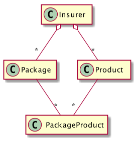

An Insurer is a resource that represents the company that offers the life products for sale. Only basic information about the insurer is available in the eBaoTech cloud services.

A Package is a way to bundle a set of products together for the purposes of distribution, i.e. these are a set of products that are complementary together. Packages will typically contain one main product plus a number of rider products. A useful analogy would be when selling a car (main product), there can be a number of accessories that are bundled together (rider products). To aid in the selling process, the package will contain information about the product features highlights, obligations, and benefits.

The Product resource is the main focus of the product domain. Apart from common attributes like product name, expiry date, etc, there are many product attributes that relate to limits (constraints) and rates that are used in the various validation and calculation rules. Instead of exposing these as raw limit and rate attributes to clients, it is easier for clients to consume the result of validators and calculators, which uses these limit and rate attributes. These validators and calculator services are designed to support the quotation process in the sales cycle. As life insurance is a virtual product, customers are not able to touch and feel the product that they are buying. To mitigate this issue, it is common that the main outcome of the quotation process is to derive an illustration that can demonstrate the benefits that the customer will enjoy when he/she buys the product.

In order to derive the illustration, two things are required:

(a) Product specification
(b) Details of the proposed insurance

* ##### Product Specification #####

  Product specification is defined using the eBaoTech Product Factory. There are many product attributes that can be defined in the product factory. Before we look at the various product attributes, let us take a step back and consider characteristics of life insurance products. These products can be considered as complex instruments that are designed to serve three purposes, i.e.
  &nbsp;
  * Protection
  * Savings
  * Investment

  There are some products (Term) which only has the protection component. Other products like Endowment products have both the protection and savings components. Yet others (ILP products) have the protection and investment components. Generally, products that have protection only or protection plus savings are classified as traditional products. Products with the investment components are classified as investment products.
  &nbsp;
  Insurance products will always have a protection component, i.e. the protection of the insured object against loss. In the case of life insurance products, the insured object is always a person, and the protection can be against different types of calamities. The common things that life insurance protects against are losses, in the event of death, permanent disabilities, critical illnesses, hospitalization,  and others types of losses. Different products are designed to protect against different kinds of losses. In defining a product in the product factory, the number of product attributes that have to be defined will depend on the type of protection the product is targeted at, as well as whether it has the savings or investment components.
  &nbsp;
  Using the eBaoTech product factory, there are many product attributes that can be defined, including the limits used for validation (age limits), and rates (premium rates, bonus rates) used by the calculation formulas (e.g. premium calculations, charges etc). In setting up the product attributes, there is also the concept of main products versus rider products. As mentioned earlier, a good analogy is that of buying a car. The base car is the main product and it is normally sold with both mandatory and recommended accessories. As an example, air-conditioning may be a mandatory accessory but leather seats are optional. Similarly, in life insurance, riders can be mandatory or optional.
  &nbsp;
  Apart from the product attributes, the product factory also allows for the definition of relationships between the products, specifically the relationship between main and rider products as well as relationships between riders.
  &nbsp;
  To continue with the car analogy, a spoiler kit may only be applicable to sedan models. Additionally, the customer may have a choice of the  "premium spoiler kit" or the "basic spoiler kit". Since, a car can only have one spoiler kit, they are mutually exclusive. In life insurance, main products have a list of attachable riders. For example, some riders are only attachable to investment linked products (e.g. unit deduction riders). In a similar fashion to spoiler kits, there are also riders that have mutually exclusive relationships, e.g. only one waiver premium rider can be attached.
  &nbsp;
  Once the product definitions are completed, the product can be tested before being loaded directly onto the cloud platform.

* ##### Proposed Insurance Details #####

  The proposed insurance refers to the data that needs to be captured during the quotation process. The amount of details can vary depending on the product. For example, if a customer wished to buy an investment product, fund allocation details will be required, whereas these details do not apply to traditional products. Additionally, data requirements for the main and rider products can also differ. For example, product-a may require the sum assured whilst product-b may require the benefit plan instead. This can present a challenge to the front end application as the input fields are dynamic and depends on the product (both main and rider products). Some of these input fields can be thought of as the risk attributes that needs to be considered by the insurer to price the premium for undertaking the risk (protection component). For the protection component, the typical risk  attributes (thus input fields) include the coverage amount, the coverage term, smoking status, gender, age, occupation, etc...
  &nbsp;
  Other input fields are based on whether the product has an saving component or an investment component. As mentioned earlier, the fund allocation inputs are only required for products with an investment component. The mitigating factor is that the universal set of input fields are fairly well defined as we are dealing with only one type of insurable object i.e. a person.

The product validation services can be used to check that the proposed insurance details are acceptable and are within the limits and constraints defined for the product.

The product calculation services will use the rates defined in the product specification and the proposed insurance details, to derive the projected values of the various benefits that the customer will enjoy over the life of the policy.

#### 1.0 Use Cases

Developing a front end application to support the quotation process is about collecting the proposed insurance details.

To start the quotation process, the are two (2) common approaches, i.e. we start with the main product selection _or_ we focus on the customer and start with selecting the prospect. This may be related to the channel that the insurance product is sold. For example, in a broker environment, there is a wider selection of products and thus the starting point for the intermediaries would be to discover the various packages (bundles of main product and riders) to understand more about the product features (benefits and obligations). In contrast, for tied agents that sell only products from one insurer, and the product range is more limited. The intermediaries are intimately more familiar with the products. In this case, the focus may be on building a long term relationship with their customers. In such a scenario, the focus is on the needs of their customer before recommending the products to the customer.

In this document, we will discuss the 1st scenario i.e. we start by discovering the packages that are available for sale. The alternate scenario will be discussed in the document for the [quotation domain](https://github.com/yitchoong/cloudapi/wiki/Quotation ).

We start the scenario where the user of the front end application starts with a browse screen containing a list of packages.

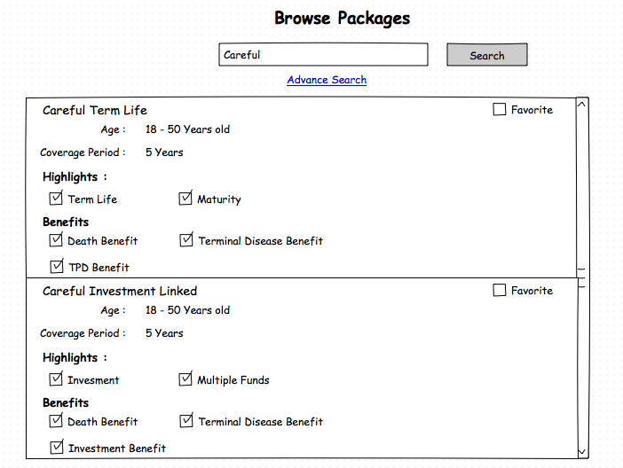

In the diagram above, we see a listing of packages with a scroll bar. There is a search box will allows for the option to filter the packages. Apart from the simple search, there is also an advanced search. So in our example, if the user follows the advance search link, he/she will be presented with the following screen. It has a list of pre-defined search values for selected keys.

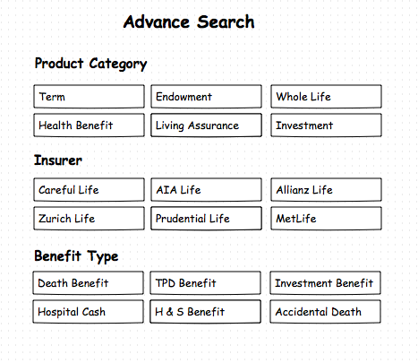

By using pre-defined values, it allows the user to just tap on the required options instead of having to use the keyboard. This is especially use for mobile environments where using the keyboard can still be a bit cumbersome.

Returning to the Browse Package page, the user can get more information about the package by tapping on one of the packages, which brings up additional information about the package, including the main product and the various riders that are in the package.

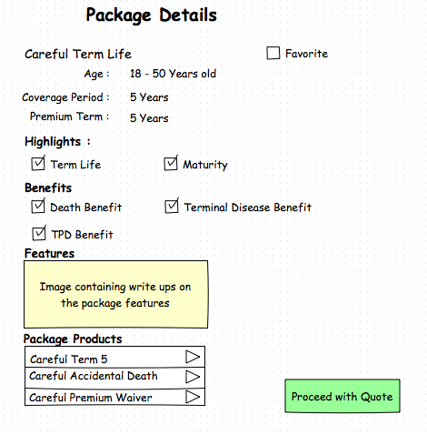

More information can be obtained when the user drills down on one of the package products.

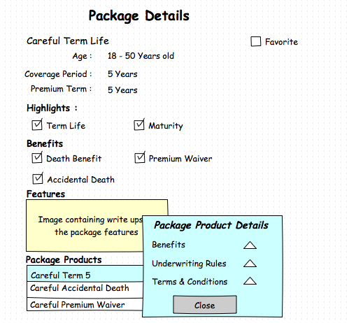

At this juncture, the user can decide to proceed with the quote or to explore another package. If the user decides to proceed, the next step is to start collecting details of the proposed insurance.

In the quotation process, there are two main insurance roles that needs to be specified i.e. the policyholder and the life assured. It could be one person having both roles (first party) or two separate persons i.e. one as policyholder and a separate person as life assured (third party). When there are two persons involved, they should be related i.e. family members. This is due to the concept of insurable interest.

Continuing with our scenario, the next step is to capture details about the policyholder and the life assured.

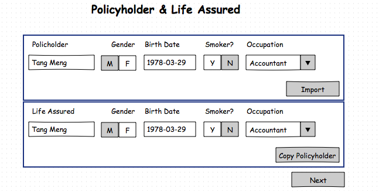

In this example, the front end application also provides a lookup capability to search for prospects already created in the application. The prospects could be persisted locally by the front end application, by a third party CRM system, or persisted using the services of the prospect domain in our eBaoTech Cloud.

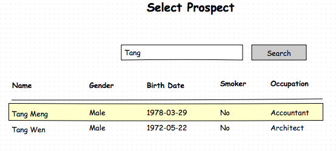

The prospect document in our example, contain information on family members which can participate in the quote. As such, the user needs to select the life assured for the quote.

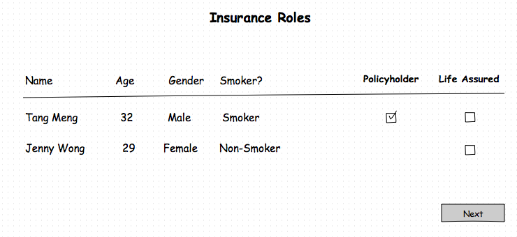

If the selected prospect did not have any family members, then the above screen is not required as the prospect is assumed to play both the policyholder and life assured roles. It should be noted that before the policyholder and life assured data can be used for the quote, it should be validated to ensure that the basic minimal information is available e.g. the birth date, and gender. These are risk attributes that are required for the assessment of the risk.

At this stage of the quotation process, the front end application will collect data for the applicable input fields of the main product e.g. sum assured, the coverage term, etc. The data captured for the main product can be validated using the product services, i.e. whether they fall within the allowed limits (e.g. the sum assured limits defined for the product). Apart from validation, the front end client can also use the product services to calculate the derived values (e.g. premium, monthly cost of insurance, surrender values) for the main product.

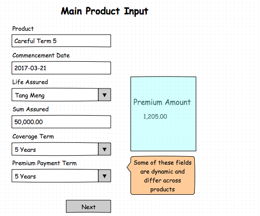

Next would be the selection of the riders and the capture of the inputs for each of the riders. Like the main product, the input fields for the riders are dynamic and defined in the product factory. Validation and calculation services are available for the riders, similar to the main product.

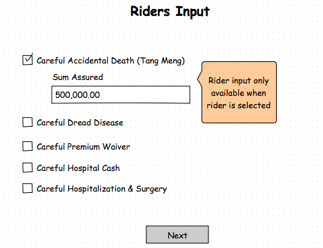

At this point in the quotation process for traditional products, all the details of the proposed insurance have been captured. The front end application user can preview the projected benefits that customer can derive (bonus payments, the death benefits, the surrender values, etc..), from buying the product. Typically, this is a table or chart showing the benefits, projected over a number of years, i.e. until the maturity of the policy. As an example, the table of benefits may look like the following:

|Yr |Age |Premium |Survival Benefit |Surrender Value |Death benefits |
|--:|---:|-------:|----------------:|---------------:|--------------:|
|1  | 40 |1,200   | 0               | 0              | 50,000        |
|2  | 41 |1,200   | 0               | 0              | 50,000        |
|3  | 42 |1,200   | 500             | 1,250          | 50,000        |
|.. |    |        |                 |                |               |
|60 | 99 |0       | 0               | 40,000         | 50,000        |

Instead of previewing the table of benefits, the product services can also  generate an illustration (plan). The illustration contains the captured inputs, the table of benefits, and all the package information i.e. the product features, clauses to clearly spell out the obligations, as well as the benefits with its associated conditions (if any).

The product services provides the illustration (plan) data, whilst the the front-end application is responsible to implement the best way to present the data e.g. as an html page or as a pdf or some other manner.

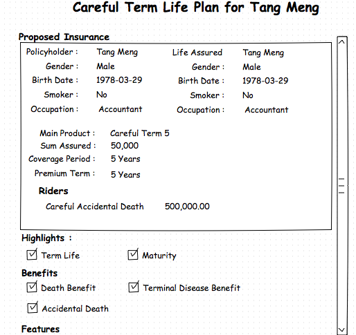
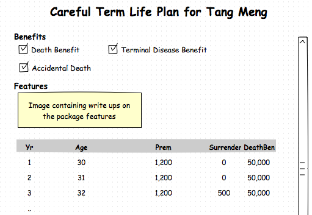

The example does not end here for investment linked products. There is additional information that needs to be captured by the front-end application. After capturing the riders data, the front end application will allow for the capture of the ad-hoc top ups and withdrawals. This is to cater to scenarios where the customer may wish to invest more money (top up) at some future date (e.g. upon reaching age 55, they will get a lump sum amount) or the customer needs to do a withdrawal in 5 years time to pay for some expenses (e.g. child goes to university). There are rules about top ups and withdrawals which are specified for the product e.g. minimum top up amount or minimum withdrawal amounts.

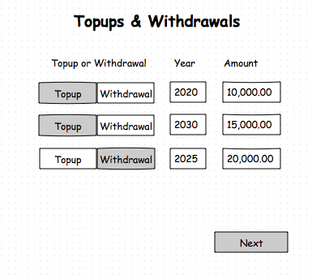

Apart from top ups and withdrawals, investment products also require the input of the fund allocation percentages. This input from the customer is used to allocate the premiums received to the various investment funds available for the main product. These different funds are likely to have different risk characteristics e.g. a bond fund (conservative), a balanced fund (balance) or equity fund (aggressive). The customer will allocate premium according to his/her risk profile. Additionally, the funds may have different projected growth rates (which will affect the calculation of the projected values).

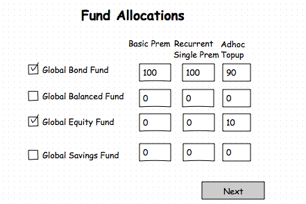

At this point, the front-end application will be able to generate the table of benefits for the investment linked products. As an example, the table may look like the following:

|Yr |Age |Basic Prem|Regular Prem|TIV(Low) | TIV (High) |DB (Low) |DB (High) |
|--:|---:|---------:|-----------:|--------:|-----------:|---------:|---------:
|1  | 40 |1,200     | 2,000      | 2,100   | 2,180      |52,100    |52,180
|2  | 41 |1,200     | 2,000      | 4,899   | 5,102      |54,899    |55,102
|3  | 42 |1,200     | 2,000      | 7,123   | 8,872      |57,123    |57,123
|.. |    |          |            |         |            |          |
|60 | 99 |0         | 0          | 82,002  | 143,289    |132,002   |193,289

Note that the fields on the table are different from those of the earlier example for traditional products. Additionally, there are two values for the TIV (Total Investment Value) and DB (Death Benefit). This is primarily because the values presented are projected values (not actual) and based on the various assumptions of the performance of the various funds. The table shows the values for the projected values based on low performance as well as values based on high performance. Basically, the values presented are projections only and **not guaranteed values**.

It is also possible to have non-guaranteed values for traditional savings products which participates in the profits of the pooled funds. Such products can have bonuses that are non-guaranteed. Depending on the rate of return, the table of benefits can have projected bonus values that are low and high (In some cases, the practice may be to have 3 projected values i.e. low, medium, and high).

With both the traditional and insurance products, the front end application can allow the user alter some of the inputs to see how it impact the illustration. As a final step, the quote can be saved using the services of the quotation domain or the front end application may choose to persist the data itself.

#### 2.0 Sequence Diagrams

Based on the above, let us look explore in more detail, how the product services can be used for our use case, i.e. a front-end application built to facilitate brokers with the quotation process.

##### 2.1 Browse Packages
Let us start the scenario where the intermediary (broker) taps on the option to browse the packages in the front end application.

  
In this case, the UI will render the first 20 packages. Assuming that these are not the packages that the user wants, he/she then looks for packages offered by the Careful Insurer. He uses the "Advanced Search" link. Please refer to the use case section for the screen mock-ups.

  

##### 2.2 Explore Package

We have now narrowed the list of packages that the user is interested in. The user may see a package that looks promising and chooses to select it for more details.

  

In this sequence diagram, the user selected the Careful Term Life package to explore further. The package will have information about the package main product as well as the package riders. When the user drills down on the main or riders in the package, it will get the additional textual write up about the product. This can include information about the underwriting rules, the benefits of the package products as well as the terms and conditions. All these provide information for the user to understand the products and features in the package.

##### 2.3 Favorite Package

The front end application may also provide a feature whereby the user can "remember" the package by allowing the user to tag a package as favourite. This will allow it it be quickly found in the future by doing a search of the favorite packages. To search for favourite packages use the GET /packages?favourite end point.

  

Removing a package from being a favourite can be done with the following end point. DELETE /packages/9101/favourite

##### 2.4 Policyholder & Life assured

Let us continue the scenario, where the user decides to proceed and selects the Careful Term Life product. The front end application starts with retrieving the initial quote data for the selected package.

  
In step 5 of our scenario, the front end application renders the Policyholder and Life assured UI. The user can enter the details about the policyholder and life assured. Alternatively, the user can import the information from the prospect database. This is the the path taken in the above sequence diagram.

In this scenario, the imported prospect has one family member, the spouse. This means that the prospect himself or the spouse can be the life assured. As such, the user is required to select who is the life assured for the quote via the Insurance Roles page. Here, the user chooses the prospect (Tang Meng) to be the policyholder and life assured. If there were no family members, front end navigation can be simplified to skip the Insurance Roles page. Please refer to the use case section for the sample mock up screens.

##### 2.5 Main Product Input

Continuing with the scenario, we now have the selected package (and thus the main product) as well as the insurance roles. The next step, is to capture the proposed insurance details for the main product. Within the package's initial quote data, there is information about the main product, including the inputFields attribute. This is a list of input field names, whose values the front end application needs to capture and submit for the calculation of the premium (and illustration fields). This list of field names, can differ across products and is determined during definition of the product using the eBaoTech product factory.

How are these field names useful? It helps the front end to dynamically decide on the input fields to display to the user. These dynamic fields can be difficult to handle when developing the front end application. A possible implementation is for the front end to allow for the data capture of the entire set of fields, for the supported products. The entire set of dynamic fields should be a manageable number(in the tens). At runtime, after getting the list of field names, the front end application can decide to show only the required fields or perhaps hide the unwanted fields.

  

In the sequence diagram above, there are two calls to the product services. The first call is to calculate the premium for the main product based on the inputs provided. For this call, the response is the same as the input provided, with the addition of the firstYearPremium field for the main product.

The second call to the validateMain validator is to ensure that all the captured input is valid. In our example, all is well, and a HTTP 200 is returned. If however, the validation fails, the sequence diagram would be as follows:

  

When validation fails, the product service will return a status code of 400 and the payload will have an object identifying the validator that triggered the error together with the error messages. In this case, we only called one validator (validateMain), so the errors are related to this validator. The products validation services do allow for an ad-hoc mechanism to trigger more than one validator in one request (see validateTopups and validateWithdrawals later in this section). As a result, the error response object is designed to handle multiple validators, each with their own error messages.

The language for the error message will be determined based on the header parameter (lang). The default language is english.

##### 2.6 Riders Input

At this stage of the quotation process, the information about the life assureds and the main product have been captured. The front end application would be deciding on how to render the riders page. As part of the preparation, it will have to make a call to the product services to determine what are the riders that can be attached to the main product. To determine the attachable (applicable) riders, the front end application has to provide details about the main product and the list of insureds.

  

The first step in this sequence diagram is to get the list of applicable riders. There are a few options for using this information by the front end. As an example, it could display them as a list and pop-up a window for data entry when one of the riders is selected. Alternatively, the front end may require the user to add a new rider where the rider list is used in a SELECT widget which allows the user to select from a dropdown. In this example, we are assuming that the riders are displayed as list, and when selected, the required data input fields will be shown (i.e. the data input requirements are only shown when selected).

From the sequence diagram above, do note that the required input fields are determined at run-time, just like the main product. Also similar to the main product, a call is made to calculate the premium after completing the data capture for the selected rider.

Apart from calculating the premium and displaying the results to the user, the front end also makes another call to get the "new" list of attachable (applicable) riders (step 11). In this example, the rider 6501 has been selected and thus no longer in the list of attachable riders. This is because we are assuming that the attachable rider can only be attached once. In the product factory, it is possible to have riders that can be attached more than once.The take away here is that the list of attachable riders depends on the main product **and** the riders that are already selected. As the list of selected riders has changed, there is a need to trigger another call to the product services to get the latest list of attachable riders.

When the user is happy with the selected riders, validation is done to ensure that all the inputs for the selected riders are valid. Of course this validation can be done earlier, i.e. after the input for each of the selected rider is complete. The validation for each of the rider is similar to that of the main product, i.e. check that the sum assured is within range, the age limits are with range, and premiums are within range.

##### 2.7 Illustration (Plan)

For the traditional products, when the riders are validated to be ok, the data capture is complete. The front-end can provide a summary page for the user to review the input (if input was done over a few pages) or if no review is required (a long page with all the data input), the front end application can allow the user to preview the table of benefits.

  
Using the table of benefits, the intermediary is then able to explain the values and discuss the results with the customer. The customer may choose to review his/her inputs and then re-generate the table of benefits. As discussed in the use case section of this document, the table of benefits (or chart) can show the amount of premium paid and the various benefits (survival benefit, bonus, death benefit, etc) based on the proposed insurance details.

One of the possible outcomes is that the intermediary can choose to share the illustration (step 9), with the customer using social media (e.g. WhatsApp or WeChat). A call is triggered to obtain the illustration data and it contains information about the proposed insurance, the table of benefits and also some static information about the plan (package), i.e. features of the product, benefits, obligations, and the terms and conditions that are applicable.

Optionally, the intermediary can choose to persist the quote. In this example, the front end chooses to use its own persistence mechanism. It should be noted that there are services in the quotation domain that can be used to persist quotes. Please refer to the document on the [Quotation Services](https://github.com/yitchoong/cloudapi/wiki/Quotation ) to explore these services further.

##### 2.8 Top-ups & Withdrawals

Thus far, the discussion has been about the quotation process of traditional life insurance products. Next, we explore the investment linked products. For the investment products, the earlier sequence diagrams are basically the same. In the Main Product Input sequence diagram (section 2.5), the steps are the same, with the exception that the client application may choose to display the monthly cost of insurance instead of the premium amount. The calculation of the monthly cost of insurance can be triggered using the POST /products/5312/calculators/monthlyCostOfInsurance end point. The premium amount for investment linked products will be the basic (target) premium amount plus any recurrent single top up amount. Both of these amounts are determined by the customer and are input fields of the main product UI in the front end application.

Similarly, the Riders Input sequence diagram (section 2.6) will have the same flow except that the amount to calculate and display would be the monthly cost of insurance instead of the premium amount. This is assuming that we are dealing with unit deduction riders. For cash paying riders, it would be appropriate to calculate and display the premium amount.

After the riders have been selected, there is more data that needs to be captured for investment linked products. With investment products, there are options for the customer to top up their accounts with additional amount during the life of the insurance policy. As an example, the customer may be expecting to receive some money in a few years time (e.g. maturity of another investment) and would like to invest the money with this policy. Alternatively, the customer could have a need to withdraw some money from the policy, to fund the child's education. This information can be captured as top ups and withdrawals in the front end application.

  
In this sequence diagram, the front end will do some data capture on the top-ups and withdrawals (if any). For each top up and/or withdrawal, the year and amount is required. When the data is complete (or after each top-up or withdrawal), the eBaoTech product services can be used to validate the top-ups and withdrawals data. Based on the main product's definition, the validation will check for minimum and maximum amounts for the top-ups and withdrawals. Additionally, there may be rules that restrict the year of the withdrawals e.g. can only withdrawal after the 5th year.

In the diagram above, there are separate calls to validateTopups and validateWithdrawals. This may be considered to be sub-optimal as two calls are made. The end points were designed for clarity and ease of use. An alternative would be to use the adhoc validator to trigger the two validators in a single request.

  
In this sequence diagram, the calls to POST /products/5312/validators/validateTopups and POST /products/5312/validators/validateWithdrawals are replaced by the single call to POST /products/5312/validators/adhoc. The end result of both sequence diagrams is the same.

##### 2.9 Fund Allocations

The final step in the quotation process for investment linked products is the data capture of the premium allocation to the various funds. As a first step, the front end application will have to obtain the list of applicable funds. There are generally two factors to determine the available funds i.e. the main product and the currency of the main product.

There is another consideration to note with respect to the fund allocation process i.e. there can be a need to differentiate the type of premium, i.e. the different types of premium may have a different allocation strategy. For an investment linked policy, there are three (3) possible types of premium i.e. (a) the regular premium (target premium / basic premium) (b) the recurrent single top-up premium, and (c) the ad-hoc top-up premium. This allows for flexibility in terms of allocating premiums to the various funds. Please refer to the use case section for a mockup of the fund allocation UI.

  
The call to validateFunds will trigger checks on the minimum fund allocation percentage (e.g. 10%). Additionally rules could be that the allocation percentages must be a multiple of 5%. Finally, the allocation percentages across all the funds must add up to 100% for each premium type, i.e. 100% for regular premium, 100% for recurrent single top-up and 100% for ad-hoc top-ups. The recurrent single top-ups and ad-hoc top-ups allocation percentages are only applicable if such premiums are requested by the customer (entered in the main product and the top-ups UI's).

At this stage, we are back to the point where are able to generate the illustration. The flow is exactly the same, just that the content is different, i.e. the illustration fields to preview are different, and the display of the illustration (plan) will be different.