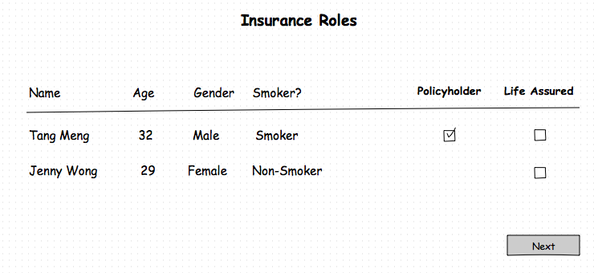

## <a >Product Domain</a>

The product domain services focuses mainly on the calculation and validation rules for the insurance products. For life insurance, these calculation and validation services are mostly used in the quotation process. As life insurance products are typically long lived virtual products (policies are multi year contracts), the quotation process will typically present an illustration to show the projected benefits (e.g. cash value, bonus) of the product over the term of the policy. To calculate these projected values, we need two (2) components i.e. **(a) product attributes including the calculation formulas that are defined using the eBaoTech product factory and (b) the proposed insurance details which includes the life assureds, and the product inputs (main and riders). For investment linked policies, the top-ups, withdrawals, and fund allocation information should also be part of the proposed insurance details.** .

Using the eBaoTech product factory, there are many product attributes that can be defined including, the various limits used for validation (age limits), the various factors and rates used by the various calculation formulas (e.g. premium calculations, charges etc). In setting the product attributes in the eBaoTech product factory, there is the concept of main products versus rider products. A good analogy of this is when you buy a car. The base car is the main product and it is normally sold with both mandatory and recommended accessories. As an example, say air-conditioning is a mandatory accessory but leather seats is an optional that the customer can decide on whether they want to purchase. Similarly, in life insurance, the customer can decide on which of the optional riders that they wish to purchase.

To continue with the car analogy, a spoiler kit may only be applicable to sedan models. Additionally, the customer may have a choice of the  "premium spoiler kit" or the "basic spoiler kit". Since, a car can only have one spoiler kit, there are mutually exclusive. In the context of life insurance world, main products have a list of attachable riders. For example some riders are only attachable to investment linked products (e.g. unit deduction riders). In a similar fashion to spoiler kits, there are also riders that are mutually exclusive, e.g. only one waiver premium rider can be attached. All these product relationships can be defined in the eBaoTech product factory (main x rider and rider x rider ).

Apart from the main product vs rider product categorization, the eBaoTech product factory also groups life insurance products as traditional versus investment products. We can think of life insurance products to be complex synthetic products (many products bundled as one product), which can include protection, savings and investment components. Generally term life products (traditional) contain only the protection component. Whole life and endowment products (traditional) consists of the protection and saving components whereas investment link products (investment) contain the protection and investment components. The applicable product attributes that needs to be defined in the eBaoTech product factory depends on the applicable components in the product. As an example, only savings products will have rates for the calculation of bonus amounts, whereas the applicable funds are only required for investment products.

Once the product definitions are completed in the product factory, the product can be tested before being loaded directly onto the cloud platform.

As to the details of the proposed insurance, these can vary based on the product definition. For example product-a may require input of the premium term whilst in product-b, the premium term is fixed and thus does not require input. This can present a challenge to the front-end client as the input fields are dynamic and based on the product (both main and rider products). Some of these input fields can be thought of as the risk attributes that needs to be considered by the insurer to price the premium for undertaking the risk (protection component).For the protection component, the typical risk  attributes (thus input fields) include the coverage amount, the coverage term, smoking status, gender, age, occupation, etc...

Other input fields are based on whether the product has an saving component or an investment component. As an example, the fund allocation inputs are only required for products with an investment component. The mitigating factor is that the universal set of input fields are fairly well defined as we are dealing with only one type of insurable object i.e. a person.

#### 1.0 Use Cases

As mentioned earlier, the services of the product domain are primarily used in the quotation process. To start the quotation process, the are two (2) common approaches, i.e. we start with the main product selection _or_ we focus on the customer i.e. we start with selecting the prospect. This may be related to the channel that the insurance product is sold from. For example, in a broker environment, there is a wider selection of products and thus the starting point for the intermediaries would be to discover the various packages (bundles of main product and riders) to understand more about the product features (benefits and obligations). In contrast, for tied agents that sell only products of one (1) insurer, the product range is more limited and the intermediaries are intimately more familiar with the products. The focus may be on building a long term relationship with their customers. In such a scenario, they will focus on the needs of their customer before recommending the products to the customer.

In this section, we will discuss the 2nd scenario i.e. for our use case, we start with the customer before selecting the product. The alternate scenario will be covered in the section that discusses the services of the Quotation domain. (Link Required)[??]. We start with a broad description of the various steps in the quotation process, which will provide the reader with a high level view before dwelling on some of the details in each of the steps.

In the quotation process, there are two main insurance roles that needs to be specified i.e. the policyholder and the life assured. It could be one person having both roles (first party) or two separate persons i.e. one as policyholder and a separate person as life assured (third party). When there are two persons involved, they should be related i.e. family members due to the concept of insurable interest.

The mechanism used to capture the details of the policyholder and life assured is determined by the front end application. One option is to capture and persist the prospect data first before creating a quotation. The prospect will always play the role of the policyholder. Family member information can be kept together with the prospect record in the event that the prospect wishes to get a third party quote or proposals. The eBao cloud services for the prospect domain is designed for this purposes. This is consistent the above-mentioned scenario of wanting to build a long term relationship with the customer, as the front end can help to manage the information about the prospect as the intermediary interacts with the prospect. It is also entirely feasible that data about the policyholder and life assured are captured in a third party system (e.g. CRM) and passed into the quotation process. The only caveat is that before the policyholder and life assured data is used in the quotation process, it should be validated to ensure that the basic minimal information is available e.g. the birth date, gender information is available. These are part of the risk attributes that are required to allow for the assessment of the risk undertake to insure the person.

In our use case, once the prospect (customer) has been selected, i.e. the policyholder and life assured data is available, the next step is to select the main product for the quote. The front-end application will need to present a list of main products for selection. The criteria for determining the list of available main products include the insurer that the intermediary is representing and also the information about the life assured. As an example, some products are designed for females only or the age of the life assured cannot exceed 50. Using these pieces of information, the eBao cloud services can help filter the available main products.

When the main product is selected, the front end application will then need to collect the data for the defined input fields of the main product e.g. sum assured, the coverage term, etc. The eBaoTech cloud services can be leveraged to validate the input values i.e. whether they fall within the allowed limits (e.g. the sum assured limits defined for the product). Apart from validation, the front end client can use the product services to calculate the values of the derived values (e.g. premium, monthly cost of insurance, surrender values) for the main product.

Next would be the selection of the riders and the capture of the inputs for each of the riders. Like the main product, the input fields for the riders are also dynamic and defined in the product factory. Validation and calculation services are available similar to the main product.

At this point in the quotation process for traditional products, all the required inputs have been captured. The front end application user can preview the projected benefits that customer can derive (bonus payments, the death benefits, the surrender values, etc..), from buying the product. Typically, this is a table showing the benefits, projected over a number of years, e.g. until the maturity of the policy. As an example, the table of benefits may look like the following:

|Yr |Age |Premium |Survival Benefit |Surrender Value |Death benefits |
|--:|---:|-------:|----------------:|---------------:|--------------:|
|1  | 40 |1,200   | 0               | 0              | 50,000        |
|2  | 41 |1,200   | 0               | 0              | 50,000        |
|3  | 42 |1,200   | 500             | 1,250          | 50,000        |
|.. |    |        |                 |                |               |
|60 | 99 |0       | 0               | 40,000         | 50,000        |


Apart from previewing the table of benefits, the eBaoTech Cloud services can also be leveraged to generate an illustration. The illustration contains the captured inputs, the table of benefits plus additional **detailed** information about the product features and clauses to clearly spell out the obligations, as well as the benefits ands its associated conditions (if any). These details form the basis for a contract should the customer proceed with the purchase. The eBaoTech cloud service generates the illustration data, whilst the the front-end application will implement the best way to present the data e.g. as an html page or as a pdf or some other manner.

In the case of investment linked products, there is additional information that needs to be captured by the front-end application before we are able to derive the table of benefits. After capturing the riders data, the front end application will allow for the capture of the ad-hoc top ups and withdrawals. This is to cater to scenarios where the customer may wish to invest more money (top up) at some future date (e.g. upon reaching age 55 they may get a lump sum amount) or the customer needs to do a withdrawal in 5 years time to pay for some expenses (e.g. child goes to university). There are normally rules about top ups and withdrawals which are specified for the product e.g. minimum top up amount or minimum withdrawal amounts.

Apart from top ups and withdrawals, investment products also require the input of the fund allocation percentages. This input from the customer is used to allocate the premiums received to the various investment funds available for the main product. These different funds are likely to have different risk characteristics e.g. a bond fund (conservative), a balanced fund (balance) or equity fund (aggressive). The customer will allocate premium according to his/her risk profile. Additionally, the funds may have different projected growth rates (which will affect the calculation of the projected values).

At this point, the front-end application will be able to generate the table of benefits for the investment linked products. As an example, the table may look like the following:

|Yr |Age |Basic Prem|Regular Prem|TIV(Low) | TIV (High) |DB (Low) |DB (High) |
|--:|---:|---------:|-----------:|--------:|-----------:|---------:|---------:
|1  | 40 |1,200     | 2,000      | 2,100   | 2,180      |52,100    |52,180
|2  | 41 |1,200     | 2,000      | 4,899   | 5,102      |54,899    |55,102
|3  | 42 |1,200     | 2,000      | 7,123   | 8,872      |57,123    |57,123
|.. |    |          |            |         |            |          |
|60 | 99 |0         | 0          | 82,002  | 143,289    |132,002   |193,289

Note that the fields on the table are different to those of the earlier example for traditional products. Additionally, there are two values for the TIV (Total Investment Value) and DB (Death Benefit). This is primarily because the values presented are projected values (not actual) and based on the various assumptions of the performance of the various funds. The table shows the values for the projected values based on low performance as well as values based on high performance. Basically, the values presented are projections only and **not guaranteed**. Btw, it is also possible to have non-guaranteed values for traditional savings products which participates in the profits of the funds. Such products can have bonuses that are non-guaranteed. Depending on the investment return of the funds, the table of benefits can have projected bonus values that are low and high (In some cases, the practice may be to have 3 projected values i.e. low, medium, and high).

Similar to the discussion earlier for the traditional products, the eBaoTech Cloud service can generate the illustration data for the investment linked products.

With both the traditional and insurance products, the front end application may choose to save the proposed insurance (input) data only, proposed insurance plus illustration data or just abandon the captured data. Alternatively, the customer may wish to alter some of the inputs to see how it impacts the table of benefits and the illustration. The front end application can also choose to use the eBaoTech cloud services (Quotation domain) to persist the data or it may persist the data itself.

#### 2.0 Sequence Diagrams

Based on the above, let us look explore in a bit more detail how the eBaoTech services (Product domain) can be used for our use case, i.e. a front-end application built to help the tied agents of an insurance company to facilitate the quotation process.

##### 2.1 Capture of policyholder and life assured data

As discussed earlier, the front-end application has various options for capturing the policyholder and life assured data, i.e. it may persist the data using the eBaoTech prospect services or perhaps keep the customer data in a third party CRM solution. It could also choose not to persist anything and just capture the data for the policyholder and life assured directly in the quotation UI. For the purpose of this discussion, let us assume that the front-end application uses the eBaoTech prospect services.

Let us start with a scenario where the intermediary is meeting up with the prospect and the prospect agrees to provide information to the intermediary for the purposes of a quotation.

```puml
title **1.0 Create prospect**
actor "User" as user
participant "Front End" as front
participant "eBao Cloud" as ebao
autonumber

user -> front : New prospect
activate front
front --> user : Render new prospect page
user -> front : Enter prospect details, includes Name, gender, \nbirth date, smoking status, occupation. Save.

front -> ebao : POST /prospects {name: "Tang Meng", gender: "Male",.. }
activate ebao
ebao --> front : HTTP 200 {pk:2100, prospectName: "Tang Meng", gender: "Male",..}
deactivate ebao
front --> user : New prospect created successfully

```
In the example, we are creating a new prospect record with enough information for the prospect to play the role as of policyholder as well as that of a life assured. If the prospect had wanted to get a life insurance quotation for his wife or children, then the details of the wife / child should be entered as well. The eBaoTech Cloud api for prospects allow for the creating of family members as part of the prospect document. The sequence diagram above will still look the same, just that the User will need to enter data about the family members as well in the front end application.

Now that we have a prospect record, the front end application may allow for a button or link in the prospect page to directly create a quote. In this case, the current prospect will be the policyholder. If there was no such button, then the entry point into the quote module will likely have a button or link to create a new quote. In such a case, the first step would be to select a prospect who will be policyholder.

If the prospect record does not have any family members, it can only mean that the prospect will play the role of policyholder as well as life assured. However, if there are family members in the prospect record, then the user will be required to select the life assured.

For the purpose of the sequence diagram, let us assume that the front end starts process for a new quote by displaying a list of prospects and the user selects the required prospect to be the policyholder.

```puml
title **2.0 Select Prospect**
actor "User" as user
participant "Front End" as front
participant "eBao Cloud" as ebao
autonumber

user -> front : New Quote
activate front
front --> ebao : GET /prospects
activate ebao
ebao --> front : HTTP 200 [ {pk:2100, prospectName: "Tang Meng",..},\n{pk:2001, prospectName:"Lin Dan",...},..]
deactivate ebao

front --> user : Display list of prospects
user -> front : Select prospect Tang Meng
front -> ebao: GET /prospects/2100
activate ebao
ebao --> front : HTTP 200 {pk:2100, prospectName:"Tang Meng",...}
deactivate ebao
front --> user : Display selected prospect
user -> front : Next
```

In this scenario, the prospect document does not have any family members related to it. As such, the prospect must play the role of both the policyholder and life assured roles. As such, the front end UI can be simplified as there is no need for the user to select the life assured. If the prospect record had family members, then it is possible that one of the family members will be the life assured while the prospect plays the role of policyholder. Of course, the prospect can still play both roles even though there are family members. In such a scenario, the front end application will require the user's intervention to select the life assured from the list of persons (prospect and family members).

As an example, a mockup of the screen might look like the following



##### 2.2 Select the Main Product

Continuing with the scenario, the next step is to determine the main product.

```puml
title **3.0 Select Main Product**
actor "User" as user
participant "Front End" as front
participant "eBao Cloud" as ebao
autonumber

front --> ebao : GET /products?birthDate=1982-05-22&gender=Male&productType=Main
activate front
activate ebao
ebao --> front : HTTP 200 [{pk:5100, productName:"Insure One",...}, {pk:5312, productName: "Cover two",..},..]
deactivate ebao

front --> user : Display list of main products
user -> front : Select main product

front -> ebao: POST /products/5312/validators/validateInsured \n{name: "Tang Meng", birthDate: "1982-05-22",...}
activate ebao
ebao --> front : HTTP 200 {pk:5312, productName:"Cover two", productCode:"CV02",...}
deactivate ebao

```

The call to validateInsured (step 5) is to check that the life assured is compatible with the selected main product. One consideration is whether the person is eligible to be the life assured for the product. Some products are targeted at females only, thus if the selected person is a male, then he would not be eligible. Some products may also have a minimum and maximum entry age. It would be part of the check of validateInsured to make sure that the person's age is within the limits defined for the product.

An example mockup of the screen might look like the following:


During the quotation process, there will be a need to calculate the premium or monthly cost of insurance for the products. The factors used to determine the appropriate rate can include the age, gender, risk class, smoking status, etc. In order to ensure that these calculations can be done, these attributes of the person must be present in the life assured's record. This is part of the compatibility check that is performed by the validateInsured validator.


##### 2.3 Main Product Input

The other item worth noting is the response from the call to validateInsured services, is that it returns the full product information. Amongst the pieces of information in the product object is the attribute inputFields. This is a list of input field names that the front end application needs to provide when submitting requests to calculate the premium (and illustration fields) for this product. This list of fields can differ across different products and is determined during definition of the product using the eBaoTech product factory.

How are these fields useful? It helps the front end to dynamically decide on the input fields to present to the user. This dynamic fields can present a challenge when developing the front end application. A possible implementation is for the front end to collect the entire set of fields for the products that is supported by the front end application. The number of input fields should be manageable (in the tens), and thus based on the fields required for the product object, it can decide to show only the required fields or perhaps hide the unwanted fields.

```puml
title **4.0 Main Product Input**
actor "User" as user
participant "Front End" as front
participant "eBao Cloud" as ebao
autonumber

activate front
front -> ebao: POST /products/5312/validators/validateInsured \n{name: "Tang Meng", birthDate: "1982-05-22",...}
activate ebao
ebao --> front : HTTP 200 {pk:5312, productName:"Cover two", productCode:"CV02",...}
deactivate ebao

front -> front : Dynamically determine applicable fields
front --> user : Render main product input page \n(only applicable fields)
user -> front : Enter input fields e.g. sum assured, coverage term,...
front -> ebao: POST /products/5312/calculators/premium \n{insuredList:[..], mainProduct:{productId:5312, sumAssured:50000, lifeAssured:0,...}}
activate ebao
ebao --> front : HTTP 200 {insuredList:[..], \nmainProduct:{productId:5312, sumAssured:50000, lifeAssured:0, firstYearPremium:1342,...}}
deactivate ebao
front --> user: Show the first year premium amount

user -> front : Next
front -> ebao: POST /products/5312/validators/validateMain \n{insuredList:[{...}], mainProduct:{pk:5312, sumAssured:50000, lifeAssured:0,.. }
activate ebao
ebao --> front: HTTP 200 {message: "ok"}
deactivate ebao
front --> front : Prepare riders page
```

In the diagram above, there are two calls to the product services. The first call is to calculate the premium for the main product based on the inputs provided. For this call, the response is the same as the input provided with the addition of the firstYearPremium field for the main product.

The second call to the validateMain validator is to ensure that all the input capture is valid. In our example, all is well, and a HTTP 200 is returned. If however, the validation fails, the sequence diagram would be as follows:

```puml
title **5.0 Main Product Input -- Errors **
actor "User" as user
participant "Front End" as front
participant "eBao Cloud" as ebao

activate front
front -> ebao: POST /products/5312/validators/validateInsured \n{name: "Tang Meng", birthDate: "1982-05-22",...}
activate ebao
ebao --> front : HTTP 200 {pk:5312, productName:"Cover two", productCode:"CV02",...}
deactivate ebao

front -> front : Dynamically determine applicable fields
front --> user : Render main product input page \n(only applicable fields)
user -> front : Enter input fields e.g. sum assured, coverage term,...
front -> ebao: POST /products/5312/calculators/premium \n{insuredList:[..], mainProduct:{productId:5312, sumAssured:50000, lifeAssured:0,...}}
activate ebao
ebao --> front : HTTP 200 {insuredList:[..], \nmainProduct:{productId:5312, sumAssured:50000, lifeAssured:0, firstYearPremium:1342,...}}
deactivate ebao
front --> user: Show the first year premium amount

user -> front : Next
front -> ebao: POST /products/5312/validators/validateMain \n{insuredList:[{...}], mainProduct:{pk:5312, sumAssured:50000, lifeAssured:0,.. }
activate ebao
ebao --> front: HTTP 400 \n[{validator:"validateMain": ["Sum Assured is less than the minimum defined for the product"]}]
deactivate ebao
front --> user : Sum Assured is less than the minimum defined for the product
```

When validation fails, the product service will return a status code of 400 and the payload will have an object identifying the validator that triggered the error together with the error messages. In this case, we only called one validator (validateMain), so the errors are related to this validator. The products validation services do allow for an ad-hoc mechanism to trigger more than one validator in one request (see validateTopups and validateWithdrawals later in this section). As a result, the error response object is designed to handle multiple validators, each with their own error messages.

The language for the error message will be determined based on the header parameter (lang). The default language is english.

A mockup sample of the main input screen might look the following:


##### 2.4 Riders Input

At this stage of the quotation process, the information about the life assureds and the main product have been captured. The front end application would be deciding on how to render the riders page. As part of the preparation, it will have to make a call to the product services to determine what are the riders that can be attached to the main product. To determine the attachable (applicable) riders, the front end application has to provide details about the main product and the list of insureds.


```puml
title **6.0 Riders Input**
actor "User" as user
participant "Front End" as front
participant "eBao Cloud" as ebao
autonumber

activate front
front -> ebao: POST /products/5312/riders \n{insuredList:[{name:"Tang Meng",..},..], mainProduct:{productId:5312,productName:"Cover Two",..},..}
activate ebao
ebao --> front : HTTP 200 [{pk:6501, productName:"Rider 01",...},{pk:6602, productName:"Rider Waiver"}..]
deactivate ebao
front -->user : Render page with list of riders
user -> front : Select a rider
front -> front : Dynamically determine applicable fields
front --> user : Render applicable fields for selected rider
user -> front : Enter input fields e.g. sum assured, benefit plan, etc
front -> ebao: POST /products/5312/calculators/premium \n{insuredList:[..], mainProduct:{productId:5312, }, riderList:[{productId:6501,..}]}
activate ebao
ebao --> front : HTTP 200 {insuredList:[..], \nmainProduct:{productId:5312, sumAssured:50000, lifeAssured:0, firstYearPremium:1342,...}\nriderList[{productId:6501, sumAssured:150000, lifeAssured:0, firstYearPremium:320}..]
deactivate ebao
front --> user: Display the first year premium amount for rider

front -> ebao: POST /products/5312/riders \n{insuredList:[..], mainProduct:{productId:5312, }, riderList:[{productId:6501,..}]}
activate ebao
ebao --> front : HTTP 200 [{pk:6602, productName:"Rider Waiver"}..]
deactivate ebao
front -->user : Render page with list of riders
user -> front : Next
front -> ebao: POST /products/5312/validators/validateRiders \n{insuredList:[{...}], mainProduct:{pk:5312, sumAssured:50000, lifeAssured:0,.. }\nriderList:[{productId:6501, sumAssured:150000,..},..]
activate ebao
ebao --> front: HTTP 200 \n{message: 'ok'}
deactivate ebao
```

The first step in this sequence diagram is to get the list of applicable riders. There are a few options for using this information by the front end. As an example, it could display them as a list and pop-up a window for data entry when one of the riders is selected. Alternatively, the front end may require the user to add a new riders and then the rider list is used in a SELECT widget which allows the user to select from a dropdown list. In this example, we are assuming that the riders are displayed as list, and when selected, the required data input fields will be shown (i.e. the data input requirements are only shown when selected).

From the sequence diagram above, do note that the applicable input fields are dynamically determined, just like the main product. Also similar to the main product, a call is made to calculate the premium after completing the data capture for the selected rider.

Apart from calculating the premium and displaying the results to the user, the front end also makes another call to get the "new" list of attachable (applicable) riders (step 11). In this example, the rider 6501 has been selected and thus no longer in the list of attachable riders. This is because we are assuming that the attachable rider can only be attached once. In the product factory, it is possible to have riders that can be attached more than once.The thing to note here is that the list of attachable riders depends on the main product **and** the riders that are selected. As the list of selected riders has changed, there is a need to trigger another call to the product services to get the latest list of attachable riders.

In this example, when the user is happy with the selected riders, validation is done to ensure that all the inputs for the selected riders are valid. Of course this validation can be done after the input for each of the selected rider is complete. The validation for each of the rider is similar to that of the main product, i.e. check that the sum assured is within range, the age limits are with range, and premiums are within range.

The following is a mockup of a riders input UI.


##### 2.5 Illustration

For the traditional products, when the riders are validated to be ok, the data capture is complete. The front-end can provide a summary page for the user to review the input (if input was done over a few pages) or if no review is required (a long page with all the data input), there should be a mechanism for the user to preview the table of benefits.


```puml
title **7.0 Preview Table of Benefits**
actor "User" as user
participant "Front End" as front
participant "eBao Cloud" as ebao
autonumber

activate front
front -> ebao: POST /products/5312/calculators/illustration \n{insuredList:[..], mainProduct:{productId:5312, }, riderList:[{productId:6501,..}]}
activate ebao
ebao --> front : HTTP 200 {insuredList:[..], \nmainProduct:{productId:5312, sumAssured:50000, lifeAssured:0, illustrationFields:{...},...}\nriderList[{productId:6501, sumAssured:150000, lifeAssured:0, illustrationFields:{...}}..]
deactivate ebao
front -> front : Prepare illustration fields for display in tabular form
front --> user : Present table of benefits
user -> front: Select Graph
front -> front : Prepare graph to illustrate benefits
front --> user: Present benefits in graphical form
user -> front : Share
front -> front : Prepare illustrationfor sharing
[<- front : share quote
user -> front : Save quote
front -> front : Persist quote

```
The intermediary is then able to explain the values in the table of benefits and discuss the results with the customer. The customer may choose to review his/her inputs and then re-do the calculation for the illustration fields. As discussed earlier in section 3.1, the table of benefits (or chart) can show the amount of premium paid and the various benefits (survival benefit, bonus, etc) from the proposed insurance.

One of the possible outcomes is that the intermediary can choose to share the illustration with the customer using social media (e.g. WhatsApp or WeChat). The illustration will contain information about the data captured, the table of benefits and also some static information about the features of the product i.e. textual data to explain the benefits in detail, the obligations, and the terms and conditions that are applicable. During the design of the front end application, a template of how the illustration should look like can be obtained using the /products/{productId}/templates/illustration end point. The template is a html page which would show the static textual information as well as dynamic elements (i.e. the input fields and illustration fields that are available in the proposed insurance object returned from POST /products/{productId}/calculators/illustration) end point.

Optionally, the intermediary can choose to persist the quote. In this example, the front end chooses to use its own persistence mechanism. It should be noted that there are services in the  eBaoTech Cloud offering that can be used to persist quotes. Please refer to the discussion on the Quotation Services to explore these services further.

The following is a sample mockup of the summary screen.


In the sample, when the preview button is tapped, it will preview the table of benefits.


##### 2.6 Top-ups & Withdrawals

Thus far, the discussion has been around the quotation process of traditional life insurance products. Next, we explore the differences with the investment linked products. The earlier sequence diagrams for selecting the prospect and the main product are exactly the same. In the Main Product Input sequence diagram, the flow would mainly be the same, with the exception that the client application may choose to display the monthly cost of insurance instead of the premium amount. The calculation of the monthly cost of insurance can be triggered using the POST /products/5312/calculators/monthlyCostOfInsurance end point. The premium amount for investment linked products will be the basic (target) premium amount plus any recurrent single top up amount. Both of these amounts are determined by the customer and thus are input fields in the main product UI of the front end application.

Similarly, the Riders Input sequence diagram would have the same flow except that the amount to calculate and display would be the monthly cost of insurance instead of the premium amount. This is assuming that we are dealing with unit deduction riders. For cash paying riders (??), it would be appropriate to calculate and display the premium amount.

After the riders have been selected, there is more data that needs to be captured for investment linked products. With investment products, there are options for the customer to top up their accounts with additional amount during the life of the insurance policy. As an example, the customer may be expecting to receive some money in a few years time (e.g. maturity of another investment) and would like to invest the money with this policy. Alternatively, the customer could have a need to withdraw some money from the policy to fund the child's education. This information can be captured as top ups and withdrawals in the front end application.

```puml
title **8.0 Topups & Withdrawals**
actor "User" as user
participant "Front End" as front
participant "eBao Cloud" as ebao
autonumber

front --> user : Render UI for top ups & withdrawals
activate front
user -> front : Enter top ups & withdrawals (year and amount)\n Next
front -> ebao: POST /products/5312/validators/validateTopups\n{insuredList:[..],mainProduct:{..}, riderList:[..],\ntopupList:[{..}], withdrawalList:[{..}]
activate ebao
ebao --> front : HTTP 200 {message: "ok"}
deactivate ebao
front -> ebao: POST /products/5312/validators/validateWithdrawals
activate ebao
ebao --> front : HTTP 200 {message: "ok"}
deactivate ebao

```
In this sequence diagram, the front end will do some data capture on the top-ups and withdrawals (if any). For each top up and/or withdrawal, the year and amount is required. The UI may allow for a range of years (e.g. year 8-10, top up 3,000.00) to simplify the data entry, but when communicating with the eBaoTech product services, some transformation of the data would be required. When the data is complete (or after each top-up or withdrawal), the eBaoTech product services can be leverage to validate the top-ups and withdrawals data. Based on the main product's definition, the validation will check for minimum and maximum amounts for the top-ups and withdrawals. Additionally, there may be rules that restrict year of the withdrawals e.g. can only withdrawal after the 5th year.

In the diagram above, there are separate calls to validateTopups and validateWithdrawals. This may be considered to be sub-optimal as two calls are made. It was designed for clarity and ease of use. The alternative would be to use the adhoc validator to trigger the two validators in a single request.

```puml
title **9.0 Validate Topups & Withdrawals -- Single Request**
actor "User" as user
participant "Front End" as front
participant "eBao Cloud" as ebao
autonumber

front --> user : Render UI for top ups & withdrawals
activate front
user -> front : Enter top ups & withdrawals (year and amount)\n Next
front -> ebao: POST /products/5312/validators/adhoc\n{validatorList:["validateTopups","validateWithdrawals"],\nproposedInsurance: {insuredList:[..],mainProduct:{..}, riderList:[..],\ntopupList:[{..}], withdrawalList:[{..}] }
activate ebao
ebao --> front : HTTP 200 {message: "ok"}
deactivate ebao

```
In this sequence diagram, the calls to POST /products/5312/validators/validateTopups and POST /products/5312/validators/validateWithdrawals is replaced by the single call to POST /products/5312/validators/adhoc. The end result of both sequence diagrams is the same.

The following is a sample mockup of the topups & withdrawals UI.


##### 2.7 Fund Allocations

The final step in the quotation process for investment linked products is the data capture of the premium allocation to the various funds. As a first step, the front end application will have to obtain the list of applicable funds. There are generally two factors to determine the available funds i.e. the main product and the currency of the main product.

There is another consideration to note with respect to the fund allocation process i.e. there might be a need to differentiate the type of premiums, i.e. the different types of premium may have a different allocation strategy. For an investment linked policy, there are three (3) possible types of premiums i.e. (a) the regular premium (target premium or basic premium) (b) the recurrent single top-up premium, and (c) the ad-hoc top-up premium. This allows for maximum flexibility in terms of allocating premiums to the various funds. Of course the UI may choose to simplify it and restrict the options for allocating the premiums to the various funds. A simplistic approach could be that all types of premiums have the same allocation percentages.

```puml
title **10.0 Fund Allocations**
actor "User" as user
participant "Front End" as front
participant "eBao Cloud" as ebao
autonumber

front --> front : Retrieve list of funds \nfrom result of Select Main Product
activate front
front --> user : Render list o funds \nAllow input of allocation percentage
user -> front : Enter fund allocation percentages by premium type
front -> ebao: POST /products/5312/validators/validateFunds \n{insuredList:[..],mainProduct:{..}, riderList:[..],\ntopupList:[{..}], withdrawalList:[{..}, fundList:[...]]
activate ebao
ebao --> front : HTTP 200 {message: "ok"}
deactivate ebao

```
The call to validateFunds will trigger checks on the minimum fund allocation percentage (e.g. 10%). Additionally rules could be that the allocation percentages must be a multiple of 5%. Finally, the allocation percentages across all the funds must add up to 100% for each premium type, i.e. 100% for regular premium, 100% for recurrent single top-up and 100% for ad-hoc top-ups. The recurrent single top-ups and ad-hoc top-ups allocation percentages are only applicable if such premiums are available (entered in the main product and the top-ups UI's).

The following is a sample mockup of a fund allocation screen.


At this stage, we are back to the point where are able to generate the illustration. The flow is exactly the same, just that the content is different, i.e. the illustration fields to preview are different, the template for the illustration is different as well.  Please refer to sequence diagram 7.0 Preview - Table of Benefits
