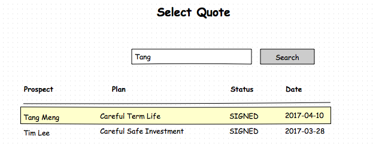
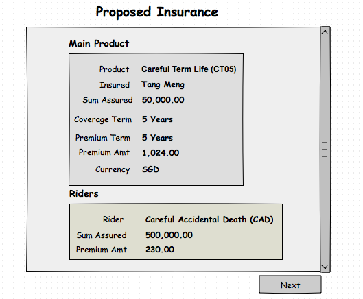
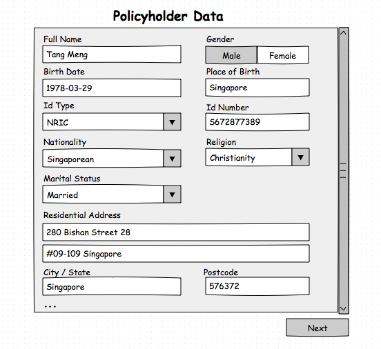
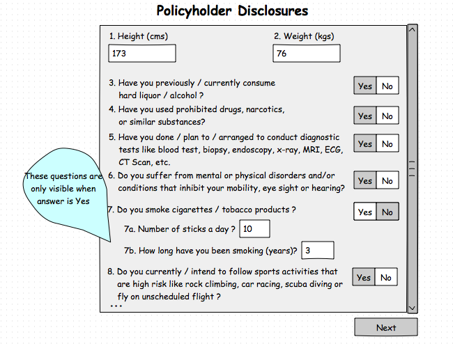
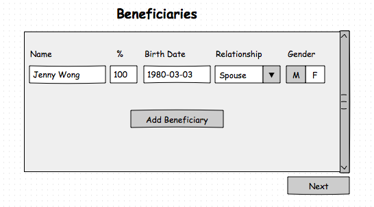
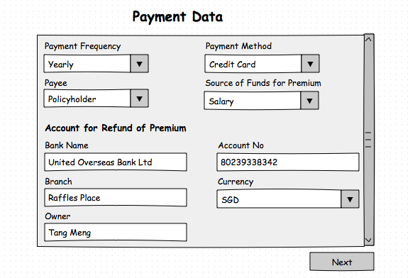
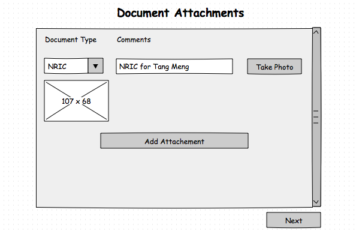
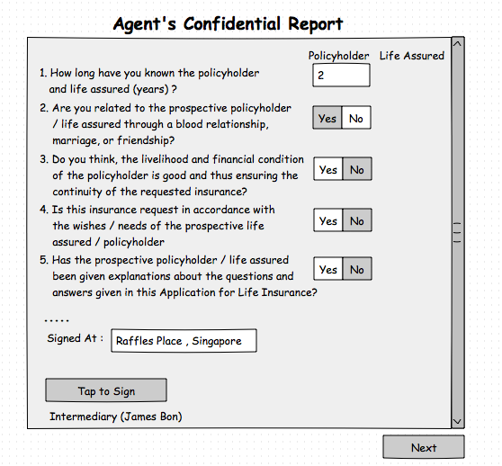
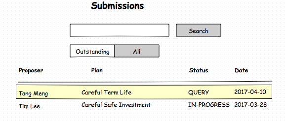
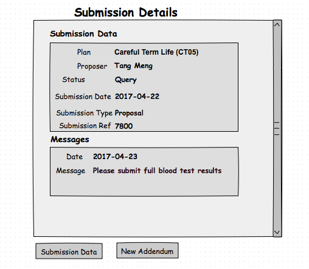

## <a >Proposal Domain</a>

The proposal domain services are designed to provide information about Proposals, Submissions, and Addendums. The primary resource is the Proposal.

The following is a diagram showing the relationship between the resources in the proposal domain.

A Proposal represents an application to purchase a life insurance policy. The application contains a fair amount of data including data on the policyholder, the life assureds, and the products (main and rider products) applied for.

The Submission resource represents an electronic submission that have been submitted to the insurer for further processing. At the present time, we are only concerned about proposal submissions. There may be other types of submissions (e.g. submission to alter a policy, submission for a claim), but in this document we are only concerned about proposal submissions.

At times, the submissions are incomplete or in other cases, additional information may be requested by the insurer. These additional information are submitted as addendums. There may be multiple addendums for one submission. In our model, the addendums have a composite relationship with the submission, i.e. addendums are part of the submission and cannot exists without the submission.

The proposal will have a number of sections e.g. the policyholder section, the proposed insurance, the beneficiary, etc. The typical proposal form will include (but not limited to) the following sections:

* Proposed insurance
* Policyholder data
* Policyholder disclosures
* Life assured data
* Life assured disclosures
* Beneficiary
* Payment
* Document attachments
* Authority and Declarations (Signature)
* Agent confidential report

Depending on the proposed insurance details, the required sections may be less than the available sections. For example if the proposer is buying the policy for his spouse, then there is a need to capture details for the policyholder and the life assured. If however, the policyholder was buying the policy for himself, then there is no need to capture data about the spouse (life assured data). In some cases, the questions within a section can also be reduced depending on the circumstances. As an example, if the life assured is male, then any female related questions can be omitted.

As there is a large amount of data that needs to be collected, one of the goals is to minimize the amount of information that is presented to the user for data entry, as filling in the application form can be quite a daunting task. Apart from reducing the amount of data that needs to be entered, another way to ease data entry is to provide default values using the prospect and quotation data. Lastly, the proposal form can be partially saved, and retrieved later for the resumption of the data entry. Doing the data entry over several sessions may be more manageable.

Other than helping to ease the data entry, the proposal services can also help to check on the completeness of the data. Each of the proposal sections have a status to indicate the completeness of the section data. Controls are in place to ensure that all section data is complete before allowing for the submission of the proposal.

Further to the submission, the insurer will process and update the submission status accordingly. These statuses can be retrieved by  using the proposal services. In some cases, the processing of the submission may require the agent / customer action, as additional information is being sought. In such cases, addendums can be uploaded to augment the proposal submission.

#### 1.0 Use Cases

The proposal form is at the end of the sales cycle for life insurance policies. In some jurisdictions, it is necessary to have completed a needs analysis and a quote (with the illustration of the plan). For the purpose of this use case, we will assume that there is a quote done  but not the financial needs analysis. Using the quote will allows us to "bring over" the proposed insurance details into the proposal form. By copying in the proposed insurance details, it (a) minimizes the data entry for the proposed insurance details, and (b) it provides information that will be used to determine the applicable sections of the proposal form.

If the financial needs analysis (FNA) is needed, then it would mean some additional validations, to ensure that the quote is consistent with the FNA. For example, a possible check would be to ensure that the prospect is the same in the Quote and the FNA. Another check could be that the product in the Quote is the same as the recommended product(s) in the FNA.

So in our example, the user starts by selecting a quote to link to the new proposal. In this case, it is a quote where the policyholder is buying the policy for himself (i.e. first party).

Only quotes that are eligible are shown here, and in this case, we select the first quote, which is a continuation of the use case discussed in the documentation for the [product domain](https://github.com/yitchoong/cloudapi/wiki/Product ).

In our sample front end application, once the quote is selected, the first screen shows the proposed insurance details (copied from the selected quote). This is to ensure that the correct quotation was selected.

The proposed insurance details will be used to determine the applicable sections of the proposal form. Continuing with the scenario, the next screen is the policyholder data page (section). Some of the information on this screen can be defaulted using the quote and prospect data. These includes the addresses, contact numbers, nationality, marital status, religion etc..

Please note that in this scenario, there are no top-ups, withdrawals, nor fund allocation details since it is not an investment product.

There is a lot of data input fields on this screen, and in this example, the user will need to scroll down for the remaining fields. Instead of the scrolling, the front end application can also choose to use tabs to organize the fields, or to use an accordion container. The point to note here is that the front end application is responsible for presenting the data in the best way for its intended audience.

The other thing to note is that a fair amount of data can be defaulted in from the quote (e.g. Name, gender, birth date) and the prospect record (Id Type, Id Number, Address, Nationality, etc). The approach to default in as much data as possible is to improve the usability of the application.

Before leaving this section, the data should be checked to ensure that the mandatory fields have been entered. The definition of which fields are mandatory is determined by the front end application. A second level check can also be done at this point, i.e. to check for the completeness of the data in the section for the purpose of submission. The proposal domain services can be used to verify the completeness (or otherwise) of the captured data for the section. There can be a difference between checking the mandatory data and the completeness check. As an example, the front end application may choose to have fewer mandatory fields to allow for partial saving of the section data.

The next section is the Policyholder Disclosures section. It captures details about the policyholder's lifestyle, habits and medical status. This section is only required if policyholder is the insured for at least one of the products (main or rider). If this is a first party proposal, then the policyholder is also the insured for the main product, and thus this section is required. For third party proposals, there are two possibilities, e.g. the proposed insurance includes a payer benefit rider where that covers the policyholder, then this section is still required. Alternatively, for a pure third party proposal (the policyholder is not an insured in any of the riders), then this section can be omitted.

The questions in this section tend to require Yes / No answers and they require additional input when a Yes answer is provided. In this example, the additional questions are only made visible when there is a Yes answer. The approach is to only show the minimum set of questions, so that the form will look "friendlier". It should also be noted that the questions here can also be dynamic, e.g. since the policyholder in this case is a male, then the question "Are you currently pregnant? " does not make sense and should be omitted.

If this was a third party proposal (e.g. policyholder buying for spouse), then we would need to collect data about the life assured (separate to policyholder) and the disclosures for the life assured. For this example, it is not required, so we will skip these sections. As a matter of interest, the data requirements for the life assured are similar to those of the policyholder.

Continuing with our example, the next section is to capture the beneficiaries data. This is normally an optional section as the data about the beneficiaries can also be provided after the policy is in-forced (i.e. the proposal is accepted).

There is only one beneficiary in this case, i.e. the spouse. The data entry for this section is pretty straight forward except the fact that there can be multiple rows in the section. The total percentage of all the rows must add up to 100%. This is a simple validation that can be implemented directly by the front end application. However, even if the front end does not implement this validation, it will be done by the proposal domain services when checking for the completeness of the section data.

Next up, is the section for the payment data. It captures data about the payment mode (frequency), payment method, etc. Below is a sample screen of the payment data section.

Some of the data for the drop values are dynamic as it is dependent on the product definition, i.e. the payment frequency and payment methods are tied to the product. Other dropdown values like "Source of Funds for Premium" are static and can be fixed during the design of the front end application.

At this point, the front end application provides a section to attached any additional documents that should be submitted together with the proposal form. Attachments can be an image of the policyholder's identification (e.g. passport), or any additional forms to support the application for the life insurance policy. On a mobile device, it would be common to just take a photo of the said document. Alternatively, on desktops, it will allow for the uploading of the image. Later in the sequence diagram section, we will further discuss the security requirements on the handling of these images, which are considered to be sensitive data and should be treated with care.

Like the section on the beneficiaries data, there can be multiple attachments in this section. During the data completeness check, validation will be done to ensure that mandatory document attachments are included in the list of attachments.

By now, the data capture for the proposal form is mostly complete and the next section is to provide some text in the declaration and authorization section before getting the policyholder to sign the application. The number of signatures depends on the number of parties involved in the proposal application. In this case here, there is only one person (Tang Meng) and the intermediary.

The image of the signatures will be shown after the customer and agent have signed. There are usually security requirements around these electronic signatures. Amongst some of the security features for the e-signatures include a watermark with the timestamp, the location, and the name of the signatory. This prevents the e-signature from being re-used for other purposes.

Another important control is to ensure that the signature is not altered during storage and transmission. To protect the integrity of the e-signature, a HMAC string can be generated and stored together with the signature in the proposal. Every time the signature is used, the HMAC code can be used to verify that the proposal data has not been altered. If the HMAC is different, it means that the data has changed, and thus the signature is invalidated. All these controls will need to be implemented by the front end application.

Continuing with our use case, the last section of the proposal form is to capture the agent's confidential report. This is about the agent's assessment and declaration about the policyholder and the life assured.

Notice that there are no input fields for the life assured column, as this is a first party proposal. If this was a third party proposal, it will have an additional column of input fields. The general approach has been to minimize data entry and to only show fields that are needed.

When the intermediary signs the confidential report, the submission button will be visible (i.e. the proposal can be submitted). When the user submits the proposal, a submission resource will be created.

Once the submission has been made, it is possible to check on the status of the submission. Let's assume that the intermediary decides to check on the status of the submission the following day. The starting point is the browse screen for submissions.

It shows the outstanding submissions instead of all submission. The intermediary notices that the status of the submission is set as QUERY, which indicates that more information is required. Typically, if there is a query on the proposal submission, the insurer will also use other channels to communicate with the intermediary and proposer e.g. via email or SMS. In this example, the front end application serves as an additional channel for notifying the intermediary that action is required from him.

Next the user selects the submission to get more details and is presented with the following screen.

In this case, the insurer has asked for a blood test. When the intermediary gets a copy of the latest blood test results from the customer, it can be submitted by creating a new addendum which is linked to the submission. The screen is similar to the document attachment screen.

In this scenario, we did not show all the possible form sections as this is a simple proposal form. In a more detailed form, there can be other sections like the beneficial owner, the use of personal data, FATCA, that have not been included in this example. These sections are similar to the sections already shown and thus does not add much to the discussion.

#### 2.0 Sequence Diagrams

Using the scenario that was discussed in the previous section, we will explore the usage of the proposal domain services by using a sample front end application. This front end application is integrated with the quotation and prospect modules, and will capture the proposal form data before submitting it to the insurer.

#### 2.1 Preparation

Before we start going through the scenario for filling in a proposal form, we begin by looking at the preparation work that can be done during the design of the front end application.

Earlier, we talked about easing the data entry of the proposal form and here we explore a number of strategies to make the proposal form filling less painful. There are as follows:

1. Only show proposal form sections which are required
2. Default in values wherever possible
3. For the required sections, only show the required questions
4. For the required questions with "child" questions, only show the child questions when needed
5. Use drop down lists of allowable values to ease data entry and to minimize errors

If we think about the first strategy, it implies that proposal forms have a number of sections. Whilst we can improve the user experience by only showing the applicable sections, the front end application has to implement all the possible sections in a proposal form. We can use the proposal services to identify all the possible sections (and questions within) in a proposal form.

An insurer may have more than one proposal form, e.g. a form for traditional products, one for unit link products.

  
In this example, we start with getting the list of forms for the insurer. Once we have that, we can get details of the sections and the questions within that section.

If we look at the details of the response to GET /proposals/template/forms/5600, it is a bit complex and require some explanation.

The structure of the response is as follows:
<pre>
  [{sectionName: "policyholder", questionList:[
      {qid:100, qtype:"field", attrName:"height", attrType:"number",
                required:true, title:"", label:"Height(cms)"},
      {qid:101, qtype:"object", attrName:"smoker", attrType:"yesno",
                required: true, title:"", label:"Do you smoke tobacco / cigarette products?",
                  objectFields:[{qid:202, label:"How many sticks a day?",..},
                                {qid:203, label: "How long have you been smoking (years)?",...}]},
      ...
    ]}
  ]
</pre>

The response contains a list of sections, and each section has a section name and a list of question meta-data. The question meta-data has a number of attributes.

|Attribute     | Description  
|:---------|:---------------------
| qid      | Question id
| qtype    | Question type, valid values are field, object, list
| attrName | Name of the field (attribute)
| attrType | Useful for determining the widget to use
| required | Whether the attribute is mandatory
| title    | Used in certain circumstances where a group of questions has a title
| label    | Label used for the attribute
| objectFields | A list of "child" questions
| listFields | A list of child questions in a subform (sub-section)

Let us take the two example questions to further explain the structure. The first question in the policyholder section is the height question. Let's say the question appears in the policyholder section as follows:

  

   Height (cms)* :  <input style="block:inline" type="text" value="175" name="height">
  

It has the qid of 100 which is the unique identifier for the question. Next is the qtype which is "field" in this case, i.e. it is a normal field. The attrName (height) is the name given to the attribute and will be used when persisting in the proposal. The attrType is useful for determining the type of widget to use in the front end application. Valid values here include, string, date, number, boolean, enum, yesno. The "required" attribute is used to determine if the field is mandatory or otherwise. The title here is empty but in some cases, it can serve as a heading title for a group of related questions. The label here is "Height (cms)*". All these serve as meta-data about the question.

Let us have a look at the 2nd field, i.e. the question about whether the policyholder is a smoker.

Here the qid is 101, and the qtype is "object", which means that there are child questions. In such a case, the objectFields attribute contains the list of child questions (with their own meta-data). The rest of the meta-data attributes are the same as the first question.

There is yet another type of question i.e. where qtype is "list", which means a sub-form. An example could be the question about "Family History", which can have a number of rows.

The attribute listFields will hold the list of question meta-data for the family history sub-form, i.e. the question meta-data for relationship, ageAtDeath, causeOfDeath, currentAge and currentHealth. Note that in this case,  the title could be set to "Family History", which is just a header title for the sub-form.

Let us return to our discussion about the various strategies to make the data entry less painful. For the fifth strategy, the front end application needs to be able to get the list of drop down values. These lists can be obtained during design time and built into the front end application instead of trying to retrieve the list during runtime.

  
In steps 1 and 2, we get the list of code tables, whilst steps 3-6 is about getting the key-value pairs for the code tables. By getting the code table values at design time, they can be stored in local persistence or directly built into the code of the front end application.

##### 2.2 Select Quote

Now that our preparation work is done, our scenario starts with the customer informing the intermediary that he is happy with the quote and would like to proceed with the application for the life insurance policy (i.e. submit a proposal). The intermediary then uses the front end application and selects the option for a new proposal. The first screen that is presented is for the selection of eligible quotes based on the status of the quotes. The eligibility rules will be implemented by the proposal domain services, thus relieving the front end application from building the rules. Please refer to the use case section for a mock up of the screen.

  

In step 6, the quote is retrieved. It includes the proposed insurance details. The first page of a new proposal is to display the proposed insurance details of the selected quote.

In rendering the page, the fields are determined by the available fields in the proposed insurance object. Please refer to the screen mockup in the use case section. In our example, the main product is the "Careful Term Life" with one rider, i.e. the Careful Accidental Death. The front end application needs to interrogate the contents on the main product object (i.e. quote.proposedInsurance.mainProduct) to decide on which fields to display. In this example, the fields with value are the productName, productCode, coverageTerm, premiumTerm, firstYearPremium, and currency. A similar approach is taken for the display the fields for each of the riders.

For the rest of the example, we are assuming that each section of the proposal form is on a new page. This is consistent with the mock up screens in the use case section.

##### 2.3 Policyholder Data

After viewing the details of the proposed insurance, the intermediary confirms that the we have the correct quote and taps on the next button. The front end application will now have to decide on the  applicable sections of the proposal form using the proposed insurance details. This is delegated to the proposal domain services to get hold of the applicable sections together with the required questions. One of the factors in determining the required questions is whether the policyholder is a person or a corporate (company). Another factor is the gender of the person.

  
In step 2, we see the call to get hold of the applicable sections based on the details of the proposed insurance. This allows the front end application to dynamically decide on the questions to render for the policyholder section. Additionally, there is call to get the prospect details in step 5. The returned information is used to default in some of the values for the policyholder section.

In steps 8 and 9, it is about re-rendering the questions to handle the scenario of child questions e.g. user selects "Others" for the Religion field, so the front end application shows the "Other Religion" input field. Other Religion is a child of the Religion field.

Steps 11 is about validation of the data entry. Checking of mandatory fields is done purely at the front end. The front end may decide to have less mandatory fields to allow for partly filled proposals that can be continued later. Alternatively, it can decide that all fields must be captured before allowing it to continue to the next section. Different use cases might have a different approach to this.

In this scenario, the front end application decides to persist the proposal at this stage and thus sends a request to create a new proposal (step 12). By saving the partly complete proposal, it allows for the proposal to filled in over a number of sessions. Alternatively, the front end application can choose to keep the incomplete proposal in memory or locally and only persist it when the proposal data entry is complete. It can also choose to persist the proposal using its own storage or other third party services.

In step 13, the newly created proposal is included in the response. In the policyholder object, there is a field to hold the section status (set to COMPLETE). This status is derived by the proposal service when the proposal is saved. If the front end does not persist the proposal using the proposal services, then an alternate end point can be used to determine the completeness of the section data ( /proposals/draft/sections/{sectionName}/status ). All the section data must be marked as complete before a proposal can be signed and submitted.

Step 15 is about providing a visual cue to the user that the data for the policyholder section is complete. This could be implemented as a "tick" next to an icon for the policyholder section.

##### 2.3 Policyholder Disclosures

In our scenario, the next required section is the policyholder disclosure section. Most of the questions in the section require Yes / No answers, with child questions that are only shown when required.

  

In the first step, we retrieve the list of applicable questions for the section. The section and questions meta-data were saved previously (policyholder data sequence diagram).

Steps 3 and 4 is about data entry that requires a re-render of the questions. For example, if the user answers "Yes" to the question "Do you smoke?", then the page needs to be re-rendered to ask the child questions "How many cigarettes a day?" and "How long have you been smoking?". These child questions were hidden initially.

In some cases, it has sub-forms. As an example, if the user answers "Yes" to a question like "Do you currently have pending or existing life insurance policies?", then details of each policy is required. Each policy will have a number of fields in a sub-form.

Similar to the policyholder data section, we check for mandatory fields at the front end. Instead of creating a new proposal, we update the current proposal (note we provide the pk and version in the request data). The status of the section is in the response to the update request and used in step 10 to provide a visual cue that the section is complete.

##### 2.4 Life Assured & Life Assured Disclosures

As this is a scenario for a first party proposal, the life assured and life assured disclosure sections are not required. These two sections are only required for third party proposal cases.

##### 2.5 Beneficiaries

The beneficiaries section is applicable for our proposal form but it is an optional section. Confused? Whilst, it is a good to capture the beneficiary data during the proposal entry, the proposal form can still be processed even if the beneficiaries have not been captured. The beneficiaries data can be provided at a later stage when the policy has been in-forced. As such the section should be available, but the data entry for the section is optional.

The thing to note about the beneficiaries section is that there are multiple rows, i.e. they are sub-forms. For each beneficiary record, the fields to capture are the name, birth date, gender, relationship to the insured, and percentage of the benefit. Please refer to the mock up screen in the use case section.

  

In this example, we take the simple route, i.e. the customer does not provide the beneficiaries data. However, there are still a few things to note about this sequence diagram. In step 1, the front end application directly renders the beneficiaries page. Unlike the previous sections, it does **not** retrieve the data on the section and the applicable questions to decide on how to dynamically render the page. This is because, the fields in the beneficiary form is stable and does not change for all the scenarios handled by the front end application.

Of course, it can still use the dynamic data approach, but fixing the page fields during development instead of during runtime is easier to implement for the front end application.

Also note that we continue to persist the partially completed proposal form, where the response indicates that the section status is COMPLETE even though there is no data. This is required as we need all application section data to be completed before the proposal can be signed and submitted.

##### 2.6 Payment Data

This section collects data about how the premium will be paid by the customer. Some of the information is defaulted from the quote (e.g. premium frequency, currency).

  
Here, we go back to using the dynamic questions approach, as the questions in the section can vary based on the data (e.g. the payment method can be dependent on the product).

_In some cases, extra security handling may be required for some of the fields captured in this section, particularly the bank account number and credit card number. These numbers should be masked (i.e. ****2312) before being displayed. If the data is persisted locally, then there may be requirements to encrypt the "data at rest". This is typically done using a symmetric key algorithm (e.g. AES-256) where the same key is used for encryption and decryption. If the data is persisted on eBaoCloud, then there is no data at rest at the front end application. For data being transmitted, the use of HTTPS to encrypt the channel should be sufficient._

##### 2.7 Document Attachments

At this stage, most of the data for the proposal form has been captured. This section is about the supporting documents for the proposal form. These are normally scanned images or photos of documents in support of the proposal. It includes images of the identification for the policyholder, and life assured, i.e. NRIC or passports or other forms of identification.

There are some concerns that have to be noted about these images. Firstly, the size of the images can be a concern.  Large images are harder to handle and can affect the performance of the application. If taking a photo, the resolution can be set accordingly. In some cases, where the image file is uploaded, there can be a check on the size of the image to disallow images larger than a set limit.

A second concern is the security around these images. These images are likely to be considered as private and therefore, needs to be handled with care. Depending on the environment (pc or mobile device) of the front end application, different requirements may apply. The common concerns are about confidentiality and integrity of the data. For confidentiality concerns, encryption is the normal control used. In this example, since we are storing the data using the proposal service and not storing it locally, we do not have to worry about encryption of the data at rest. During transmission, the front end application communicating with the proposal services should be using the HTTPS protocol i.e. an encrypted tunnel, so this should be sufficient. However, any transient copies of the images (e.g. in the gallery or temp files) needs to be cleaned up.

  

In this section, the number of questions are few and unchanging, and like the beneficiaries section, we are **not** using the dynamic questions approach.

Here, we are assuming that the front end application has access to the device camera. Other options could be to upload the image file. Here we set the camera to low resolution to reduce the size of the image (step 5). After taking the photo, we show a thumbnail of the image to allow viewing the image to ensure that it is satisfactory.

In step 11, the front end application checks for the mandatory fields (e.g. the attachment type) and in step 12, we save the proposal before moving on to the next section.

##### 2.8 Authority and Declarations

There are a number of clauses in this section, which is static text and unlikely to change. However, the number of signatories required depends very much of the parties involved in the application for the life insurance policy. The front end application can choose to implement the rules directly using the section meta-data. Each of the signatory can be considered to be a question and thus can be handled by retrieving the applicable questions for the section.

For the signatures, there might be legislation governing these electronic signatures. As an example, in Singapore, there is the electronic transactions act (ETA) which spells out the requirements for the electronic signature i.e.

* Unique to the person
* Capable of identifying the person
* Created in a manner or using a means under the sole control of the person
* linked to the electronic record to which it relates in a manner such that if the record is changed, the signature will be invalidated

To meet these requirements, there are some controls that needs to be implemented. These include the following:

* The image of the signature will be persisted allowing for later retrieval. Due to the unique characteristic of the signature, it can be considered as unique to the person
* The name and timestamp will be captured together with the signature and can be used to identify the person signing on the proposal. This information is then used to create a watermark and placed in the image of the signature.
* As the policyholder and life assured would be directly signing on the device, it will satisfy point 3.
* lastly, a HMAC is generated based on the data captured and persisted together with the signature. This can be checked to ensure that the content has not changed, and where the content has changed, the signature will be invalidated.

Like the handling of the document attachments in the previous section, any transient images must be properly cleaned up.

  

In this example, there is only one person involved i.e. the policyholder, so there are only two signatories required i.e. the policyholder and the intermediary. Notice that there is a check to make sure all the section data is complete before allowing the signature (steps 4 and 10).

As discussed earlier, we create watermarked images as well as a HMAC of the proposal data to link to the signatures prior to saving the data. This is entirely optional and depends on the security requirements of the front end application.

In saving the proposal, the response returns the updated proposal object (step 18) with the status set as SIGNED.

##### 2.9 Agent Confidential Report

This section is about the intermediary's declaration and assessment about the policyholder and life assured (if applicable). There is a signature in this section and the required controls will be the same as those in Declarations & Authority section of the proposal form.

  

In steps 1 and 2 we dynamically render the applicable questions for the section. Since this is a first party proposal, the questions that relate to the life assured are not required.

When all the questions have been answered, and the user wishes to sign the section, there are checks to ensure that the proposal is ready for the signature.

After saving the proposal, the returned proposal object will have the status set as "PENDING-SUBMISSION" if the proposal is ready for submission. In such a case, the submission button will be made visible.

##### 2.10 Proposal Submission

At this point in time, we have a proposal that has been signed and ready for submission. The submission button is made visible in the Agent Confidential Report page when the proposal status is "PENDING-SUBMISSION". Upon submission, the proposal status is marked as SUBMITTED, which is the final status for the proposal. Tracking is transferred to the Submission resource.

The design of the submission resource allows for different types of submissions, e.g. a claim submission, a submission to alter the policy contract. Here, we are only interested in the proposal submission.

In designing the proposal domain services, the intention was to cater to use cases where the proposal is saved using the proposal services as well as use cases where the persistence of the proposal is handled directly by the front end application. In cases where where the persistence of the proposal is handled directly, the submission must include all the details of the proposal. However, in our scenario the proposal is persisted using the product services, thus, we only need to provide a reference to the proposal document.

  
In this example, the user taps on the submission button from the agent confidential report page to submit the proposal. A response with the newly created submission resource will be returned. The status of the submission can be tracked separately from the proposal. As mentioned earlier, upon the successful submission, the proposal status will be updated.

If the proposal data is persisted elsewhere, then the front end application will need to take care of updating the proposal status.

##### 2.10 Submission Status

Some time after the submission, the intermediary may wish to check on the status of the submission. This can be done by searching for the submission and selecting it to get more details.

Submissions can have messages and addendums associated with it. Messages are textual in nature where the insurer may advice that additional information is required, or that proposal has been accepted or declined.

Addendums are additional attachments to the submission, e.g. a doctors report or some test results.

  
In this sequence diagram, we start with getting a list of submissions that are pending. The list is then presented to the user of the application.

The user then selects one of the submissions (step 5) and the additional details are retrieved and presented to the user. For more information, please refer to the mock up screen in the use case section above.

##### 2.11 Submitting an Addendum

Continuing with the scenario, upon viewing the status of the proposal submission, the intermediary contacts the customer and gets the results of the blood tests requested. The test report can be submitted via the front end application.

After navigating to the Submission Details screen (refer section 2.10 above), the user then chooses to add a new addendum. A screen is then presented to take a photo of the report, add some remarks and then submit the addendum.

  
The handliing of the addendum is similar to that of the document attachments, i.e. the low resolution picture, and the cleaning of the temp files (if any).

In this sequence diagram, most of the work is done in the client application, and the proposal domain services are only used to submit the addendum.