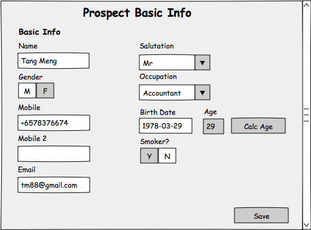

## <a name="prospects">Prospect Domain</a>
The main resource in the Prospect domain is the Prospect resource. In the context of this document, a Prospect represents a person who has shown that they are interested to buy a life insurance policy. Apart from the Prospect, there is the Assignment resource. It represents a prospect assignment, which is a follow-up task from the Insurer to the intermediary (to contact the prospect).

Below is a simple class diagram to show the relationship between the resources in the prospect domain.


The prospect domain services are mainly used for  persistence, i.e. create, update, delete and retrieval of a single prospect documents. Apart from these CRUD services for individual prospects, there are services that allow for the bulk creation of prospects.

In the use case section below, we will discuss some of the scenarios for using the Prospect domain services.


#### 1.0 Use Cases

For our example, we are looking at building a front end application that  will help us to maintain sales related information about prospects. We will assume that there is not much difference between how the brokers and agents work, in relation to maintaining the prospect details.

So, how are prospect records created and how much information should the application keep about a prospect? As to how the prospect records are created, the options include:

* Prospects are manually created
* The prospects are created by copying the details from the mobile phone contacts or third-party applications
* In the case of agents, the prospects could be “pushed” or assigned from the insurer (e.g. there was a road show and some people left their business card for follow up)

The second question is how much information should we keep about a prospect. This might depend on how much information the agent/broker (intermediary) can get about the prospect. The ability to get more information depends of the readiness of the prospect to buy a policy. We envisage the following possibilities,

* The agent/broker starts with minimal information initially and they progressively get more information with each subsequent interaction as the prospects gets more interested to buy.
* The agent/broker are able to get detailed information from the prospect from the start, as the prospect is ready for a quotation or proposal.

On the question of what type of information  is available, the expectation is that we can get information that is be used in the sales process, i.e. information required for the FNA, Quotation and Proposal.

There could be other information that would be useful to managing the relationship with the prospect, and these can be accommodated using the extension fields, i.e. these would be considered as part of local customizations. There is also the consideration about how much information the intermediary is willing to share, i.e. the intermediary may **not** be willing to enter in information that does not help them in the downstream activities.

Based on the above discussion, let us now explore some of the functions that would be available in a front end application built to maintain the prospect records.

As a start, the front end application will need a screen to search for prospects that have been previously created by the intermediary. Searching is mainly based on the name of the prospect.


In the event that the required prospect record does not exists, the user can create a new one. For this example, we will assume that the user chooses to import an existing contact. This could be from the device contact or from a third party application. It is up to the front end application to implement this functionality.


After selecting the required contact and tapping on "Import", the contact record is copied and the first screen presented to the user is the screen to capture the basic information about the prospect. In this example, the imported contact record is used to default some of the values. The user can enter additional information about the prospect.



Since we allow the prospect record to be created with minimal information,  some of the fields (e.g. occupation, birth date) will be optional. At a minimum, we should have the name of the prospect and a way to contact the prospect, so the mobile number or the email address needs to be available.

In this example, we will assume that the customer wants to get a quotation, and thus is willing to provide most of the requested information for the basic information page. After saving the data, the user will be presented with a screen with all the details about the prospect.


From the screen mockup, we can see that there are four groups of information about a prospect, i.e. the basic info, the family info, the address info and finally some personal information. Family information is used when the prospect requires a third party quotation, e.g. quotation for a life insurance policy for his spouse. The address and personal information is used for the proposals input form.

Under each of the groups of information, there is an edit button that can be used to navigate to the appropriate page for the update of the prospect record.


Apart from creating the prospect record one at a time, the front end application also has functions whereby the prospect records are assigned to the agent for follow up.

These prospect assignments will be "uploaded" by the insurer, and when an agent logs into the front end application, the user is notified of the pending assignments. The user can then choose to preview the assignments.


The intermediary can choose to accept or reject the assignment. When the selections are processed, prospect records will be created for the accepted assignments. To make it more efficient, the prospect records will be created in bulk. For the assignments that are not accepted nor rejected, there is an expiry date. At the end of the expiry date, the assignments are considered to be rejected by the intermediary.


#### 2.0 Sequence Diagrams

Based on the above, let us look at how the eBaoCloud services can be leveraged by a front-end application to allow for the maintenance of prospect records.

##### 2.1 Manual creation of prospects

  The intermediary wants to create a new prospect and starts by checking to see if the prospect (e.g. Tang Meng) already exists. The search prospects UI is used to search the prospects database. Upon finding that the prospect record does not exist, the intermediary decides to add a new prospect. The basic information page is presented by the front-end application. The user then enters the minimum information required to create a new prospect i.e. Name, Gender, Mobile Number.  Next, the user taps on the save button in the front-end application.  A message is presented to notify the user that the prospect record has been successfully created.


```puml

actor User
participant "Front End" as F
participant "eBao Cloud" as ebao
User -> F : Search prospects
activate F
F -> ebao : GET /prospects?filter=prospectName*startsWith*T
activate ebao
ebao --> F : HTTP 200 {docs:[prospectName:"Tom Fang",..},{prospectName:"Tim Lee",...}],..}
deactivate ebao
F --> User : Display prospects
User -> F : New prospect
F --> User : Display Prospect UI (Basic)
User -> F : Enter name, gender, mobile number. Tap Save
F -> ebao : POST /prospects/\n{prospectName: 'Tang Meng', gender: 'Male', mobileNumber: '+8678928292' }
activate ebao
ebao --> F : HTTP 200 {prospectId:10001, prospectName:'Tang Meng',....}
deactivate ebao
F --> User : Prospect created successfully
deactivate F

```
  If the client application submitted insufficient data to create the prospect record, the cloud API would return an error response instead e.g. if the mobile number was not provided in the request to create a new prospect
  ```puml

  actor User
  participant "Front End" as F
  participant "eBao Cloud" as ebao
  User -> F : Search prospects
  activate F
  F -> ebao : GET /prospects?filter=prospectName*startsWith*T
  activate ebao
  ebao --> F : HTTP 200 {docs:[prospectName:"Tom Fang",..},{prospectName:"Tim Lee",...}],..}
  deactivate ebao
  F --> User: Display prospects
  User -> F : New prospect
  F --> User : Display Prospect UI (Basic)
  User -> F : Enter name, gender. Tap Save
  F -> ebao : POST /prospects/\n{prospectName: 'Tang Meng', gender: 'Male'}
  activate ebao
  ebao --> F : HTTP 400  { errors: [{ message: "Mobile number is required.", field: "mobileNumber" }] }
  deactivate ebao
  F --> User : Mobile number is required
  deactivate F

  ```
  Please note that the response HTTP status code is 400, which means that there are client data errors.

  A slight variation to the scenario is where the the prospect data is imported from the mobile device or from a third party service (e.g. CRM). In such a scenario, the front-end client application will need to implement additional functionality for the import. The sequence diagram will look like the following:

  ```puml
  actor User
  participant "Front End" as F
  participant "eBao Cloud" as ebao
  User -> F : Search prospects
  activate F
  F -> ebao : GET /prospects?filter=prospectName*startsWith*T
  activate ebao
  ebao --> F : HTTP 200 {docs:[prospectName:"Tom Fang",..},{prospectName:"Tim Lee",...}],..}
  deactivate ebao
  F --> User: Display prospects on search prospect page
  User -> F : Import Contact
  F -> F : Get list of contacts from device
  F --> User : Display list of contacts
  User -> F : Select contact to import
  F -> F : Copy contact data (use to default prospect values)
  F --> User : Display Prospect UI (Basic)
  User -> F : Select the gender for the prospect. Tap save.
  F -> ebao : POST /prospects/\n{prospectName: 'Tang Meng', gender: 'Male', mobileNumber: +861788912990, \nemail: 'tm88@gmail.com'}
  activate ebao
  ebao --> F : HTTP 200 {prospectId:10001, prospectName:'Tang Meng',....}
  deactivate ebao
  F --> User : Prospect created successfully
  deactivate F
  ```

##### 2.2 Update of prospect information

  Continuing with the scenario, the intermediary has met up with Tang Meng and he has agreed to a provide additional information about himself so that the intermediary can prepare a quotation for him. Since it is a quotation for himself, only the prospect basic information is required. The smoker status, occupation and birth date information was provided. The intermediary uses the front-end application to retrieve the prospect record for Tang Meng, so that the additional information can be updated into the prospect record.

  ```puml
  actor User
  participant "Front End" as F
  participant "eBao Cloud" as ebao
  User -> F : Search prospects
  activate F
  F -> ebao : GET /prospects?filter=prospectName*startsWith*Tang%20Meng
  activate ebao
  ebao --> F : HTTP 200 {docs:[{prospectId:10001, prospectName: "Tang Meng",version:1, ...}],..}
  deactivate ebao

  User -> F : Select prospect 10001 for editing
  F -> ebao : GET /prospects/10001
  activate ebao
  ebao --> F : HTTP 200 {prospectId:10001, prospectName: "Tang Meng",version:1,...}
  deactivate ebao
  F --> User : Display Prospect Detail Page
  User -> F :  Edit Basic Info
  F --> User : Display Prospect Basic Info page
  User -> F : Enter birthDate. Tap calculate age
  F -> ebao : GET /prospects/age?ageMethod=ANB&birthDate=1978-05-29
  activate ebao
  ebao --> F : HTTP 200 { age: 29 }
  deactivate ebao
  F --> User : Display age as 29
  User -> F : Enter smoker status, and occupation. Tap Save.
  F -> ebao : PUT /prospects/10001\n{prospectName: 'Tang Meng', \ngender: 'Male', mobileNumber: '+8678928292', \nsmoker: "Non-Smoker", birthDate:"1978-05-29", occupation:"200" , version: 1,.. }
  activate ebao
  ebao --> F : HTTP 200 {prospectId:10001, prospectName:'Tang Meng',version:2,....}
  deactivate ebao
  F --> User : Prospect updated successfully
  deactivate F
```

If Tang Meng had been interested in a proposal, he would have needed to provide additional information, e.g. his nationality, religion, residential addresses, marital status, employment status etc (his personal data) and his residential and office addresses. The sequence diagram to show how the information is updated is similar to the one above, i.e. we retrieve the record, and select the page to update, enter the additional data, and save the prospect record. Please refer to the mock up screens in the use case section.

##### 2.3 Deletion of prospect document

An alternate outcome could be that Tang Meng is totally not interested in buying any insurance, and thus the intermediary decides to remove the prospect record from the system. There will be some controls for the removal of prospect record, e.g. if there are existing quotations for the prospect, the deletion would not be allowed. In this case, there is no activity for Tang Meng, so his prospect record can be deleted.

```puml
actor User
participant "Front End" as F
participant "eBao Cloud" as ebao
User -> F : Search prospects
activate F
F -> ebao : GET /prospects?filter=prospectName*startsWith*Tang%20Meng
activate ebao
ebao --> F : HTTP 200 {docs: [{prospectId:10001, prospectName: "Tang Meng",version:1, ...}],..}
deactivate ebao
F --> User: Display list of prospects
User -> F : Select prospect 10001 for editing
F -> ebao : GET /prospects/10001
activate ebao
ebao --> F : HTTP 200 {prospectId:10001, prospectName: "Tang Meng", version:1,...}
deactivate ebao
F --> User : Display prospect details for Tang Meng
User -> F : Tap on delete icon
F --> User : "Please confirm Deletion"
User -> F : "Yes"
F -> ebao : DELETE /prospects/10001?version=1
activate ebao
ebao --> F : HTTP 200 { message: "Prospect record deleted"  }
deactivate ebao
F --> User : Prospect record was successfully deleted
deactivate F
```

In the scenario described above, the conversation between the front-end application and the eBaoCloud service is as follows :

* fetch a list of prospect records (summary)
* select the required prospect record (detailed)
* save changes / delete the selected prospect record

In order to reduce the "chattiness" of the conversation between the front end application and the eBaoCloud services, an alternate implementation could be as follows:

* fetch a list of detailed prospect records (but limit to only 10 rows)
* save changes / delete the selected prospect record

The idea is to fetch detailed information about each prospect up-front instead of just the selected prospect. However, we limit the number of rows to reduce the payload size.

In such a case, the sequence diagram for the deletion of the Tang Meng prospect record would be as follows:

```puml

actor User
participant "Front End" as F
participant "eBao Cloud" as ebao
User -> F : Search prospects "Tang Meng"
activate F
F -> ebao : POST /prospects/detailed\n?filter=prospectName*startsWith*Tang%20Meng&offset=0&limit=10
activate ebao
ebao --> F : HTTP 200 {docs:[{prospectId:10001, prospectName: "Tang Meng",version:1, ...}],..}
deactivate ebao
F --> User: Display list of prospects ( rows 1-10 )
User -> F : Select prospect 10001 for editing
F --> User : Display prospect details for Tang Meng\n(use information retrieved earlier)
User -> F : Tap on delete icon
F --> User : "Please confirm Deletion"
User -> F : "Yes"
F -> ebao : DELETE /prospects/10001?version=1
activate ebao
ebao --> F : HTTP 200 {message: "Prospect record deleted"}
deactivate ebao
F --> User : Prospect record was successfully deleted
deactivate F

```

##### 2.4 Bulk creation of prospects

Thus far, we have been looking at creating and maintenaning the prospect record individually, i.e. one at a time. As discussed earlier, there may be cases where the prospect data is assigned by the insurer and for the purpose of efficiency and performance, it may be better to allow for the bulk creation of the prospect records.

In such a scenario, we start from the insurer's perspective, i.e. they have a list of prospect records which they have assigned to their agents. For the purpose of this discussion, we will assume that the insurer has an application that can communicate with the eBaoCloud service.

```puml

participant "Insurer App" as ins
participant "eBao Cloud" as ebao

ins -> ebao : POST /assignments/_bulk\n[ {operation:'CREATE', doc:{assignmentType:"Prospect", data: { prospectName: "Lin Dan", agent: "agent007",..},...}},\n  {operation:'CREATE', doc:{assignmentType:"Prospect", data: {prospectName: "Tang Meng", agent: "agent007", ..}...}}...\n]
activate ins
activate ebao
ebao --> ins : HTTP 200 [{pk: 2000, assignmentType:"Prospect", data:{prospectName: "Lin Dan", agent:"agent007",...}},\n  {pk: 2001, assignmentType:"Prospect", data:{prospectName: "Tang Meng", agent:"agent007",...}}]
deactivate ebao
deactivate ins

```

With this operation, the assignments are stored on the platform. When the intermediary next logs into the front end application, the intermediary is notified of the prospect assignments. In this scenario, the user (agent007) chooses to preview the assignments before accepting the assignments.

```puml

actor User
participant "Front End" as F
participant "eBao Cloud" as ebao

User -> F : Preview assignments
activate F
F -> ebao : GET /assignments?filter=assignmentType*eq*Prospect
activate ebao
ebao --> F : HTTP 200 {docs:\n[{pk: 2000, assignmentType:"Prospect", data:{prospectName: "Lin Dan", agent:"agent007",..}},\n {pk: 2001, assignmentType:"Prospect", data:{prospectName: "Tang Meng", agent:"agent007",..}},..],...}
deactivate ebao
F --> User : Display assignments
User -> F : Select Lin Dan ,Tang Meng.\nAccept.
F -> ebao: POST /prospects/_bulk \n[{operation:'CREATE', assignmentId:2000, doc: \n {prospectName: "Lin Dan", mobileNumber: 12837122, gender:Male,..}}\n {operation:'CREATE', assignmentId:2001, doc: \n {prospectName: "Tang Meng", mobileNumber: "12839943", gender: "Male",..}}..]
activate ebao
ebao -> ebao : Update assignments\n(accepted).\nCreate prospects
ebao --> F : HTTP 200 \n[{pk: 3000, prospectName: "Lin Dan", agent:"agent007",...},\n {pk: 3001, prospectName: "Tang Meng", agent:"agent007",...}...]
deactivate ebao
F --> User: New prospects created
deactivate F

```

To complete the loop, there may be cases of assignments which are rejected or past the expiry date. In such cases, the insurer may wish to retrieve the assignments that were rejected or expired and re-assign them.

```puml

participant "Insurer App" as ins
participant "eBao Cloud" as ebao

ins -> ebao : GET /assignments?filter=expired*eq*true
activate ins
activate ebao
ebao --> ins :  HTTP 200 {docs:[{pk: 2000, assignmentType:"Prospect", prospectName: "Rudy Hartono", agent:"agent009",...}],...}
deactivate ebao
ins -> ins : Store the list of rejected / expired assignments locally
' deactivate ins

```
