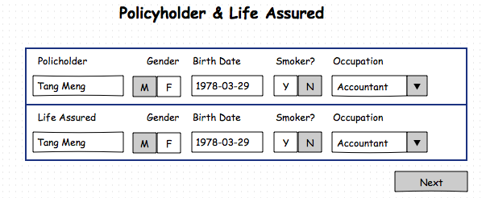
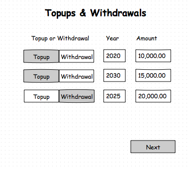
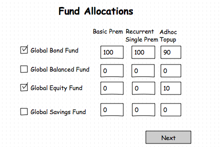

## <a >Quotation Domain</a>

The primary resource that is managed by this domain is the Quote resource. Below is a simple class diagram to show its relationship with other resources managed by services the eBaoTech life insurance Cloud.


In the above class diagram, the Quote class has a composition relationship with the Illustration class, i.e. the Illustration class cannot exists on its own and is considered to be part of the Quote class.

We can think of the illustration (Plan) as the output of the quotation process. It contains the proposed insurance, the table of benefits, plus some static information about the plan, i.e. the features, obligations, and benefits that the customer will receive, should he/she proceed with the policy (contract).  These pieces of information about the product are part of the product specification that is defined using the eBaoTech product factory.

The Illustration class also has a composition relationship with a Share class. The Share class represents an object that tracks information about the illustration being shared with the customer. An illustration can be share multiple times. Whilst typically, we expect that there is only one Share object per illustration, it is possible that the customer may request for the illustration to be shared to different apps.

The illustration is the desired output from the quotation process. Before the illustration can be produced, there are two components that are required.

* Proposed Insurance details
* Product specification

##### Proposed Insurance Details

The proposed insurance details represent the input data that is required before we can generate the illustration. It will contain the following pieces of information:

  * The policyholder and life assured's data
  * The main product data
  * The rider products & their data

For a traditional product quote, that is all the required data. However, for an investment product quote, it will include additional data about:

  * Top-ups
  * Withdrawals
  * Fund allocations

So, based on what is being proposed, and using information about the product specification (main & rider products), there are quotation services that can generate the values for a table of benefits. This table contains the projected values of the various benefits (survival benefit, cash bonus benefit, death benefit etc) that the customer can enjoy over the life the policy. The following is a sample of how a simple table of benefits might look like.


|Yr |Age |Premium |Survival Benefit |Surrender Value |Death benefits |
|--:|---:|-------:|----------------:|---------------:|--------------:|
|1  | 40 |1,200   | 0               | 0              | 50,000        |
|2  | 41 |1,200   | 0               | 0              | 50,000        |
|3  | 42 |1,200   | 500             | 1,250          | 50,000        |
|.. |    |        |                 |                |               |
|60 | 99 |0       | 0               | 40,000         | 50,000        |


##### Product Specification #####

The product specification can be defined using the eBaoTech Product Factory. In order to have a better understanding of the various product attributes, it is good to take a step back and consider the characteristics of life insurance products. Life insurance products can be considered as complex instruments that are designed to serve three purposes, i.e.

* Protection
* Savings
* Investment

There are some products (Term) which only has the protection component. Other products like Endowment products have both a protection and savings components. Yet others (ILP products) have the protection and investment components. Generally, products with protection only or protection +  savings purposes are classified as traditional products. Products with the investment components are classified as investment products.

Insurance products will always have a protection component, i.e. the protection of the insured object against loss. In the case of life insurance products, the insured object is always a person, and the protection can be against different types of calamities. The common things that life insurance protects against are losses, in the event of death, permanent disabilities, critical illnesses, hospitalization,  and others types of losses. Different products are designed to protect against different kinds of losses. In defining a product in the product factory, the number of product attributes that have to be specified will depend on the type of protection the product is targeted, and whether it has the savings or investment components.

Using the eBaoTech product factory, there are many product attributes that can be defined, including the limits used for validation (age limits), and rates (premium rates, bonus rates) used by the calculation formulas (e.g. premium calculations, charges etc). In setting up the products, there is also the concept of main products versus rider products. As mentioned earlier, a good analogy is that of buying a car. The base car is the main product and it is normally sold with both mandatory and optional accessories. As an example, air-conditioning may be a mandatory accessory but leather seats are optional. Similarly, in life insurance, riders can be mandatory or optional.

Apart from the product attributes, the product factory also allows for the definition of relationships between the products, specifically the relationship between main and rider products as well as relationships between riders.

To continue with the car analogy, a spoiler kit may only be applicable to sedan models. Additionally, the customer may have a choice of the  "premium spoiler kit" or the "basic spoiler kit". Since, a car can only have one spoiler kit, they are mutually exclusive. In our context, main products have a list of attachable riders. For example, some riders are only attachable to investment linked products (e.g. unit deduction riders). In a similar fashion to spoiler kits, there are also riders that have mutually exclusive relationships, e.g. only one waiver premium rider can be attached.

Once the product definitions are completed, the product can be tested before being loaded directly onto the eBaoTech cloud platform.


#### 1.0 Use Cases

Developing a front end application to support the quotation process is about collecting the proposed insurance details, and generating the illustration (plan) for presentation to the customer.

To start the quotation process, the are two common approaches, i.e. we start with the main product selection _or_ we focus on the customer i.e. we start with selecting the prospect. In this document, we will discuss the 2nd scenario i.e. we start with the customer before selecting the product. The alternate scenario will be covered in the document for the [product domain](https://github.com/yitchoong/cloudapi/wiki/Product).

In this section, we will describe the various steps in the quotation process, which will provide the reader with a high level view before dwelling on some of the details in each of the steps. The steps discussed here is a variation of the flow described in the document for the [product domain](https://github.com/yitchoong/cloudapi/wiki/Product). As such, when reading these two documents, there might be a sense of duplication, which is to be expected.

Let us start our scenario with the agent (intermediary) meeting the prospect for the first time and manages to get the prospect to provide sufficient information to generate a quote. The agent uses the front end application to record these details in its prospect UI pages.

In the quotation process, there are two main insurance roles that needs to be specified i.e. the policyholder and the life assured. It could be one person having both roles (first party) or two separate persons i.e. one as policyholder and a separate person as life assured (third party). When there are two persons involved, they must be related i.e. family members. This is due to the concept of insurable interest. In our scenario, the prospect is married and thus the wife's details are included in the prospect record.

Please refer to the document on the [prospect domain](https://github.com/yitchoong/cloudapi/wiki/Prospect) for more details .

Continuing with the scenario, the user starts a new quote and is presented with the following screen.


Selecting the prospect is the first step for a new quote. The selected prospect will be the policyholder in the quote. In our case, the prospect record includes details for the spouse. As a result, the system is not able to automatically determine the life assured for the quote. The next screen  presented to the user looks like the following:


In this scenario, either the prospect or the spouse can be the life assured. Here, we will assume that the prospect (Tang Meng) will be the policyholder as well as the life assured. The details of the policyholder and life assured will be defaulted into the following UI on the front end application.




In this case, the policyholder and life assured data is defaulted using the prospect record.

Alternatively, data about the policyholder and life assured could have been captured in a third party system (e.g. CRM) and defaulted into the quotation process. The data must be checked before the policyholder and life assured data is used. It is validated to ensure that the basic minimal information is available e.g. the birth date, gender. These are part of the attributes required for the risk assessment and thus used in the  calculation of the premium amount.

The next step is to select the main product for the quote. The front-end application will need to present a list of main products for selection. The factors for determining the list of available main products include the insurer that the agent works for and also the data about the life assured. As an example, some products are designed for females only or the age of the life assured cannot exceed 50. Using these pieces of data, the quotation services can help to filter out the available main products.


When the main product is selected, the front end application will then need to collect the proposed insurance details for the main product e.g. sum assured, the coverage term, etc.


It should be noted that the input fields are dynamic and vary across products. The required dynamic fields for a product are specified when the product is defined in the product factory. The quotation services can also be used to validate the input values i.e. whether they fall within the allowed limits (e.g. the sum assured limits defined for the product). Apart from validation, the front end client trigger services to calculate the quote values (e.g. premium, monthly cost of insurance, surrender values) for the main product.


Next would be the selection of the riders and the capture of the inputs for each of the riders. Like the main product, the input fields for the riders are also dynamic and defined in the product factory. Validation and calculation services are available similar to the main product.


At this point in the quotation process for traditional products, all the required inputs have been captured. The front end application can allow the user to preview the projected benefits that customer can enjoy (bonus payments, the death benefits, the surrender values, etc..), when buying the policy. Typically, this is a table showing the benefits, projected over a number of years, e.g. until the maturity of the policy. As an example, the table of benefits may look like the following:

|Yr |Age |Premium |Survival Benefit |Surrender Value |Death benefits |
|--:|---:|-------:|----------------:|---------------:|--------------:|
|1  | 40 |1,200   | 0               | 0              | 50,000        |
|2  | 41 |1,200   | 0               | 0              | 50,000        |
|3  | 42 |1,200   | 500             | 1,250          | 50,000        |
|.. |    |        |                 |                |               |
|60 | 99 |0       | 0               | 40,000         | 50,000        |


Apart from previewing the table of benefits, the quotation services can also be leveraged to generate an illustration (plan) for presentation to the customer. The presentation will contain the captured inputs, the table of benefits plus additional **detailed** information about the product features and clauses to clearly spell out the obligations, as well as the benefits ands its associated conditions (if any). These details form the basis for a policy (contract) should the customer proceed with the policy. The quotation service generates the data required for the illustration presentation, whilst the the front-end application will decide on the best way to present the data e.g. as an html page or as a pdf or some other manner.


In the case of investment linked products, there is additional information that needs to be captured by the front-end application before we are able to derive the table of benefits. After capturing the riders data, the front end application will allow for the capture of the ad-hoc top ups and withdrawals.



This UI is to cater to scenarios where the customer may wish to invest more money (top up) at some future date (e.g. upon reaching age 55 they may get a lump sum amount) or the customer needs to do a withdrawal in 5 years time to pay for some expenses (e.g. child goes to university). There are normally rules about top ups and withdrawals which are specified for the product e.g. minimum top up amount or minimum withdrawal amounts. Do take note that top-ups and withdrawals are optional.

Apart from top ups and withdrawals, investment products also require the input of the fund allocation percentages.



This UI captures the customer's intent on how premiums received will be used to invest in the various funds available for the main product. These different funds are likely to have different risk characteristics e.g. a bond fund (conservative), a balanced fund (balance) or equity fund (aggressive). The customer will allocate premium according to his/her risk profile. Additionally, the funds may have different projected growth rates (which will affect the calculation of the projected values).

At this point, the front-end application will be able to generate the table of benefits for the investment linked products. As an example, the table may look like the following:

|Yr |Age |Basic Prem|Regular Prem|TIV(Low) | TIV (High) |DB (Low) |DB (High) |
|--:|---:|---------:|-----------:|--------:|-----------:|---------:|---------:
|1  | 40 |1,200     | 2,000      | 2,100   | 2,180      |52,100    |52,180
|2  | 41 |1,200     | 2,000      | 4,899   | 5,102      |54,899    |55,102
|3  | 42 |1,200     | 2,000      | 7,123   | 8,872      |57,123    |57,123
|.. |    |          |            |         |            |          |
|60 | 99 |0         | 0          | 82,002  | 143,289    |132,002   |193,289

Note that the fields on the table are different to those of the earlier example for traditional products. Additionally, there are two values for the TIV (Total Investment Value) and DB (Death Benefit). This is primarily because the values presented are projected values (not actual nor guaranteed) and based on assumptions about the performance of the funds. The table shows the values for the projected values based on low performance and high performance.

It is also possible to have non-guaranteed values for traditional products which participates in the profits of the pooled funds. Such products can have bonuses that are non-guaranteed. Depending on the rate of return of the pooled funds, the table of benefits can have projected bonus values that have low and high performance. (In some cases, the practice may be to have 3 projected values i.e. low, medium, and high).

Similar to the earlier discussion for traditional products, the quotation service can generate the illustration data for the investment linked products.

With both the traditional and insurance products, the customer may ask to alter some of the inputs to see how it impacts the table of benefits. As a final step, the front end application can save the quote or just abandon the captured data.

#### 2.0 Sequence Diagrams

Based on the above, let us look explore in a bit more detail how the quotation services can be used for our use case, i.e. a front-end application built to help the tied agents of an insurance company to facilitate the quotation process.

##### 2.1 Capture of policyholder and life assured data

The front-end application has various options for capturing the policyholder and life assured data, i.e. it may persist the data using the prospect services or perhaps keep the customer data in a third party CRM solution. It could also choose not to persist anything and just capture the data for the policyholder and life assured directly in the quotation UI. For the purpose of this discussion, let us assume that the front-end application uses the prospect services.

We start with the creation of a new prospect in the front end application.

```puml
title **Create prospect**
actor "User" as user
participant "Front End" as front
participant "eBao Cloud" as ebao
autonumber

user -> front : New prospect
activate front
front --> user : Render new prospect page
user -> front : Enter prospect details, includes Name, gender, \nbirth date, smoking status, occupation. Save.

front -> ebao : POST /prospects {name: "Tang Meng", gender: "Male",..\nfamily:[{relationship:"Spouce", relationName: "Jenny Wong",..}] }
activate ebao
ebao --> front : HTTP 200 {pk:2100, prospectName: "Tang Meng", gender: "Male",..\nfamily:[{relationship:"Spouce", relationName: "Jenny Wong",..}]}
deactivate ebao
front --> user : New prospect created successfully

```
In the example, we are creating a new prospect record with enough information for the prospect to play the role as of policyholder as well as that of a life assured. Information about the spouse is also captured in this scenario. The prospect services allow for the creating of family members as part of the prospect document.

Now that we have a prospect record, let us create a new quote. Let us assume that the entry point into the quote module has a button or link to create a new quote and the first step for a new quote is to select a prospect who will be the policyholder.

In this example, the front end starts the process for a new quote by displaying a list of prospects and the user selects the required prospect to be the policyholder.

```puml
title **Select Prospect**
actor "User" as user
participant "Front End" as front
participant "eBao Cloud" as ebao
autonumber

user -> front : New Quote
activate front
front --> ebao : GET /prospects
activate ebao
ebao --> front : HTTP 200 {docs:[ {pk:2100, prospectName: "Tang Meng",..},\n{pk:2001, prospectName:"Lin Dan",...},..],..}
deactivate ebao

front --> user : Display list of prospects
user -> front : Select prospect Tang Meng
front -> ebao: GET /prospects/2100
activate ebao
ebao --> front : HTTP 200 {pk:2100, prospectName:"Tang Meng",...\nfamily:[{relationship:"Spouse",relationName:"Jenny Wong"}]}
deactivate ebao
front --> user : Render Insurance Roles page
user -> front :  Select "Tang Meng" as life assured
front -> front : Copy prospect data to Policyholder & Life assured page
front --> user : Render Policyholder & Life assured page with default data
user -> front : Next
```

In this scenario, the prospect document includes information about the spouse. As such, in step 8, the front end application needs to "ask" the user to select the life assured. If the prospect document has no family data, then the life assured can be assumed to be the same as the policyholder and this step can be skipped. Please refer to the earlier section (Use cases) for the mockup screens (Insurance roles + Policyholder & Life Assured).


##### 2.2 Select the Main Product

Continuing with the scenario, the next step is to determine the main product.

```puml
title **Select Main Product**
actor "User" as user
participant "Front End" as front
participant "eBao Cloud" as ebao
autonumber

front --> ebao : POST /quotes/draft/products \n{insuredList:[{name:"Tang Meng",birthDate:"1978-03-29"..}]..}
activate front
activate ebao
ebao --> front : HTTP 200 {docs:[{pk:5100, productName:"Careful Savings Life",...}, {pk:5312, productName: "Careful Term",..},..],..}
deactivate ebao

front --> user : Display list of main products
user -> front : Select main product

front -> ebao: POST /quotes/draft/products/5312 \n{insuredList:[{name:"Tang Meng",birthDate:"1978-03-29"..}]..}
activate ebao
ebao --> front: HTTP 200 {pk:5312, productName: "Careful Term",inputFields:["sumAssured","coveragePeriod",..], ...}
deactivate ebao

```
In the above sequence diagram , the end point POST /quote/draft/products is used to get the list of main products (step 1). As the list of insured is included in the request to the service, the list of products will be filtered to ensure that it only contains products where the life assured is eligible.

##### 2.3 Main Product Input

In the previous sequence diagram, the main product document was retrieved by a call to the quotation services for the selected product. Amongst the pieces of data in the product document is the inputFields attribute. It is a list of input field names, whose values the front end application needs to submit when making requests to calculate the premium (and illustration fields). This list of field names can be different  across products and is defined during the setup of the product using the eBaoTech product factory. Put in another way, it represents the list of "required" input fields for this product.

How is the list of field names useful? It helps the front end to dynamically decide on the input fields to present to the user. These dynamic fields can be a challenge when developing the front end application. A possible implementation is to build a front end that can capture the values of all the possible fields of the supported products. At run-time, it will decide to only show the required fields or hide the unwanted fields. The universal set of fields should be a manageable number as we are only dealing with one insurable object, the person.


```puml
title **Main Product Input**
actor "User" as user
participant "Front End" as front
participant "eBao Cloud" as ebao
autonumber

activate front
front -> front : Get the required input fields from the product object
front --> user : Render main product input page \n(only required fields)
user -> front : Enter input values e.g. sum assured, coverage term,...
front -> ebao: POST /quotes/draft/calculators/premium \n{insuredList:[..], mainProduct:{productId:5312, sumAssured:50000, lifeAssured:0,...}}
activate ebao
ebao --> front : HTTP 200 {insuredList:[..], \nmainProduct:{productId:5312, sumAssured:50000, lifeAssured:0, firstYearPremium:1342,...}}
deactivate ebao
front --> user: Show the first year premium amount

user -> front : Next
front -> ebao: POST /quotes/draft/validators/validateMain \n{insuredList:[{...}], mainProduct:{pk:5312, sumAssured:50000, lifeAssured:0,.. }
activate ebao
ebao --> front: HTTP 200 {message: "ok"}
deactivate ebao
front --> front : Prepare riders page
```

In the diagram above, there are two calls to the quotation services. The first call is to calculate the premium for the draft quote.  For this call, the response object is the same as the input object with the addition of the firstYearPremium field.

The second call to the validateMain validator is to ensure that all the input captured for the main product in the draft quote is valid. In our example, all is well, and a HTTP 200 is returned. If however, the validation fails, the sequence diagram would be as follows:

```puml
title **Main Product Input -- Errors **
actor "User" as user
participant "Front End" as front
participant "eBao Cloud" as ebao

activate front
front -> front : Get the required input fields from the product object
front --> user : Render main product input page \n(only required fields)
user -> front : Enter input values e.g. sum assured, coverage term,...
front -> ebao: POST /quotes/draft/calculators/premium \n{insuredList:[..], mainProduct:{productId:5312, sumAssured:50000, lifeAssured:0,...}}
activate ebao
ebao --> front : HTTP 200 {insuredList:[..], \nmainProduct:{productId:5312, sumAssured:50000, lifeAssured:0, firstYearPremium:1342,...}}
deactivate ebao
front --> user: Show the first year premium amount

user -> front : Next
front -> ebao: POST /quotes/draft/validators/validateMain \n{insuredList:[{...}], mainProduct:{pk:5312, sumAssured:50000, lifeAssured:0,.. }
activate ebao
ebao --> front: HTTP 400 \n[{validator:"validateMain", errorList: ["Sum Assured is less than the minimum defined for the product"]}]
deactivate ebao
front --> user : Sum Assured is less than the minimum defined for the product
```

When validation fails, the product service will return a status code of 400 and the payload will have an object identifying the validator that triggered the error together with the error messages. In this case, we only called one validator (validateMain), so the errors are related to this validator. The product validation services allow for an ad-hoc mechanism to trigger more than one validator in one request (see validateTopups and validateWithdrawals later in this document). As a result, the error response object is designed to handle multiple validators, each with their own error messages.

The language for the error message will be determined based on the header parameter (lang). The default language is english.


##### 2.4 Riders Input

At this point, the information about the life assureds and the main product have been captured. The front end application would be deciding on how to render the riders page. As part of the preparation, it will make a call to the quotation services to determine what are the riders that can be attached to the main product. To determine the attachable (applicable) riders, the front end application has to provide details about the main product and the list of insureds.


```puml
title **Riders Input**
actor "User" as user
participant "Front End" as front
participant "eBao Cloud" as ebao
autonumber

activate front
front -> ebao: POST /quotes/draft/products/{5312}/riders \n{insuredList:[{name:"Tang Meng",..},..], mainProduct:{productId:5312, productName:"Careful Term",..},..}
activate ebao
ebao --> front : HTTP 200 [{pk:6501, productName:"Careful Accidental Death",...},{pk:6602, productName:"Careful Premium Waiver"}..]
deactivate ebao
front -->user : Render page with list of riders
user -> front : Select a rider
front -> front : Get required fields from the selected rider product object
front --> user : Render required fields for selected rider
user -> front : Enter input fields e.g. sum assured, benefit plan, etc
front -> ebao: POST /quotes/draft/calculators/premium \n{insuredList:[..], mainProduct:{productId:5312, }, riderList:[{productId:6501,..}]}
activate ebao
ebao --> front : HTTP 200 {insuredList:[..], \nmainProduct:{productId:5312, sumAssured:50000, lifeAssured:0, firstYearPremium:1342,...}\nriderList[{productId:6501, sumAssured:500000, lifeAssured:0, firstYearPremium:320}..]
deactivate ebao
front --> user: Display the first year premium amount for rider

front -> ebao: POST /quotes/draft/products/5312/riders \n{insuredList:[..], mainProduct:{productId:5312, }, riderList:[{productId:6501,..}]}
activate ebao
ebao --> front : HTTP 200 [{pk:6602, productName:"Careful Premium Waiver"}..]
deactivate ebao
front -->user : Render page with list of riders
user -> front : Next
front -> ebao: POST /quotes/draft/validators/validateRiders \n{insuredList:[{...}], mainProduct:{pk:5312, sumAssured:50000, lifeAssured:0,.. }\nriderList:[{productId:6501, sumAssured:500000,..},..]
activate ebao
ebao --> front: HTTP 200 \n{message: 'ok'}
deactivate ebao
```

The first step in this sequence diagram is to get the list of attachable riders. There are a few options for using this information by the front end. For example, it could display them as a list and pop-up a window for data entry when one of the riders is selected. Alternatively, the user can tap on "Add Rider" and a new rider row will be presented. The new row will have a SELECT widget to allow the user to select the attachable riders from a dropdown list. In this example, we are assuming that the riders are displayed as list, and when selected, the required data input fields will be shown (i.e. the data input requirements are only shown when selected). Please refer to the mockup screen in the use case section of this document.

From the sequence diagram above, the required input fields are dynamically determined, similar to the main product. Like the main product, a call is made to calculate the premium after completing the data capture for the selected rider.

Apart from calculating the premium and displaying the results to the user, the front end also makes another call to get the "new" list of attachable (applicable) riders (step 11). In this example, the rider 6501 has been selected and thus no longer in the list of attachable riders. This is because we are assuming that the attachable rider can only be attached once. In the product factory, it is possible to have riders that can be attached more than once. The thing to note here is that the list of attachable riders depends on the main product **and** the riders that are already attached. As the list of attached riders has changed, there is a need to trigger another call to get the latest list of attachable riders.

In this example, when the user is happy with the selected riders, validation is done to ensure that all the inputs for the selected riders are valid. Of course this validation can be done after the input for each of the selected rider is complete. The validation for each of the rider is similar to that of the main product, i.e. check that the sum assured is within range, the age limits are with range, and premiums are within range.


##### 2.5 Illustration

For the traditional products, the data capture is complete when the riders are validated. The front-end can provide a summary page for the user to review the input (if input was done over a few pages) or if no review is required (a long page with all the data input), the front end application can preview the table of benefits.


```puml
title **Table of Benefits & Illustration**
actor "User" as user
participant "Front End" as front
participant "eBao Cloud" as ebao
autonumber

activate front
front -> ebao: POST /quotes/draft/calculators/illustration \n{insuredList:[..], mainProduct:{productId:5312, }, riderList:[{productId:6501,..}]}
activate ebao
ebao --> front : HTTP 200 {proposedInsurance: {insuredList:[..], mainProduct:{productId:5312, illustrationFields:{...},...} \nriderList[{productId:6501, illustrationFields:{...}}..]}, \ntableOfBenefits: {columnTitles:[{colunoNo:1,columnTitle:"Year",...}], tableData:[{columnNo:1, value:1},..]}
deactivate ebao
front -> front : Prepare illustration fields for display in tabular form
front --> user : Present table of benefits
user -> front: Select Graph
front -> front : Prepare graph to illustrate benefits
front --> user: Present benefits in graphical form
user -> front : Save quote
front -> ebao : POST /quotes {insuredList:[..], mainProduct:{productId:5312,..},\nriderList:[{productId:6501,..}]}
activate ebao
ebao --> front: HTTP 200 {pk:8201, version:1, insuredList:[..], mainProduct:{productId:5312,..},\nriderList:[{productId:6501,..}]}
deactivate ebao
front --> user : Quote was successfully saved
user -> front : Share via WeChat
front -> ebao : POST /quotes/8201/illustration
activate ebao
ebao --> front : HTTP 200 {proposedInsurance:{..}, tableOfBenefits:{}, planInfo:{..}}
deactivate ebao
front -> front : Prepare illustration output for sharing on WeChat
[<- front : share quote on WeChat
front -> ebao: POST /quote/8201/illustration/shares {shareType:"WeChat", timestamp: "2017-04-12 12:34", ...}
activate ebao
ebao --> front : HTTP 200 {message: "ok"}
deactivate ebao

user -> front : Share via WhatsApp
front -> front : Prepare illustration for sharing on WhatsApp
[<- front : Share quote on WhatsApp
front -> ebao: POST /quote/8201/illustration/shares {shareType:"WhatsApp", timestamp: "2017-04-12 12:41", ...}
activate ebao
ebao --> front : HTTP 200 {message: "ok"}
deactivate ebao
```

In this scenario, the intermediary generates the illustration and is then able to explain the values in the table of benefits and discuss the results with the customer. The customer may choose to review his/her inputs and then re-do the calculation for the illustration fields. As mentioned earlier in the use case section of this document, the table of benefits (or chart) can show the amount of premium paid and the various benefits (survival benefit, bonus, etc) based on the proposed insurance.

When the customer is happy, the quote (and thus the illustration within) is saved. The illustration contains information about the proposed insurance (data captured), the table of benefits, and also some static information about the features of the products i.e. textual data to explain the benefits, the obligations, and the terms and conditions that are applicable.

If the customer requests for a copy of the illustration, the intermediary can use the Share function and forward a copy of the illustration via a messaging applications like WeChat or WhatsApp. In this example, the customer asks the intermediary to share it both via WhatsApp as well as WeChat (because the customer has different apps installed on different devices). Note that there is call to the quotation service for saving the share information, which will useful for analytics.

During the design of the front end application, a html template of illustration can be obtained using the GET /quotes/templates?products=5312 end point. The template is a html page which would show the static textual information as well as variable elements (i.e. fields that are available in the response returned from the POST /quotes/draft/illustration) end point).


##### 2.6 Top-ups & Withdrawals

Thus far, the discussion has been about the quotation process for traditional life insurance products. We will now explore the process for investment linked products.

The earlier sequence diagrams are all still applicable. In the Main Product Input sequence diagram, the exception is that the client application may choose to display the monthly cost of insurance instead of the premium amount. The calculation of the monthly cost of insurance can be triggered using the POST /quotes/draft/calculators/costOfInsurance end point. The premium amount for investment linked products is a simple formula (addition of the basic premium and the recurrent single top-up) that can be handled directly in the front end application.  These two amounts are determined by the customer and captured in the main product UI of the front end application.

Similarly, the Riders Input sequence diagram has the same flow, except that the amount to calculate and display would be the monthly cost of insurance instead of the premium amount. This is assuming that we are dealing with unit deduction riders (i.e. cost of insurance is funded by deducting units from the investment funds). For cash paying riders, it would be appropriate to calculate and display the premium amount.

After the riders are selected, there is more data that has to be captured for investment linked products. With investment linked products, it is possible for the customer to top up the investment amount, during the life of the insurance policy. As an example, the customer may be expecting to receive some money in a few years time (e.g. maturity of another investment) and would like to invest the money with this policy. Alternatively, the customer could have a need to withdraw some money from the policy to fund the child's education. This information can be captured as top ups and withdrawals in the front end application.

```puml
title **Topups & Withdrawals**
actor "User" as user
participant "Front End" as front
participant "eBao Cloud" as ebao
autonumber

front --> user : Render UI for top ups & withdrawals
activate front
user -> front : Enter top ups & withdrawals (year and amount)\n Next

front -> ebao: POST /quotes/draft/validators/validateTopups\n{insuredList:[..],mainProduct:{..}, riderList:[..],\ntopupList:[{..}], withdrawalList:[{..}]
activate ebao
ebao --> front : HTTP 200 {message: "ok"}
deactivate ebao
front -> ebao: POST /quotes/draft/validators/validateWithdrawals
activate ebao
ebao --> front : HTTP 200 {message: "ok"}
deactivate ebao

```
In this sequence diagram, the front end will do some data capture on the top-ups and withdrawals (if any). For each top up and/or withdrawal, the year and amount is required. When the data is complete (or after each top-up or withdrawal), the quotation services can be used to validate the top-ups and withdrawals data. Based on the main product's definition, the validation will check for the minimum and maximum amounts allowed. Additionally, there may be rules that restrict year of the withdrawals e.g. can only withdrawal after the 5th year.

In the diagram above, there are separate calls to validateTopups and validateWithdrawals. This may be considered to be sub-optimal, as two calls are made. It was designed for clarity and ease of use. The alternative would be to use the adhoc validator to trigger the two validators in a single request.

```puml
title **Validate Topups & Withdrawals -- Single Request**
actor "User" as user
participant "Front End" as front
participant "eBao Cloud" as ebao
autonumber

front --> user : Render UI for top ups & withdrawals
activate front
user -> front : Enter top ups & withdrawals (year and amount)\n Next
front -> ebao: POST /quotes/draft/validators/adhoc\n{validatorList:["validateTopups","validateWithdrawals"],\nproposedInsurance: {insuredList:[..],mainProduct:{..}, riderList:[..],\ntopupList:[{..}], withdrawalList:[{..}] }
activate ebao
ebao --> front : HTTP 200 {message: "ok"}
deactivate ebao

```
In this sequence diagram, only one call to the quotation service is required to validate the top-ups and withdrawals. The end result of both sequence diagrams is the same.


##### 2.7 Fund Allocations

The final step in the quotation process for investment linked products is the data capture of the premium allocation to the various funds. As a first step, the front end application retrieves the list of applicable funds from the main product object (section 2.2). This list of funds will have to be filtered based on the currency of the proposed insurance's main product.

There is another consideration to note with respect to the fund allocation process i.e. the need to differentiate the type of premiums. Different types of premium may have a different allocation strategy. For an investment linked policy, there are potentially three (3) types of premiums i.e. (a) the regular premium (target premium / basic premium) (b) the recurrent single top-up premium, and (c) the ad-hoc top-up premium. This allows for flexibility in terms of allocating premiums to the various funds. Please refer to the use case section for a mockup of the fund allocation UI.

```puml
title **Fund Allocations**
actor "User" as user
participant "Front End" as front
participant "eBao Cloud" as ebao
autonumber

front --> front : Retrieve list of funds \nfrom result of Select Main Product
activate front
front --> user : Render list o funds \nAllow input of allocation percentages
user -> front : Enter fund allocation percentages by premium type
front -> ebao: POST /quotes/draft/validators/validateFunds \n{insuredList:[..],mainProduct:{..}, riderList:[..],\ntopupList:[{..}], withdrawalList:[{..}, fundList:[...]]
activate ebao
ebao --> front : HTTP 200 {message: "ok"}
deactivate ebao

```
The call to validateFunds will trigger checks on the minimum fund allocation percentage (e.g. 10%). Additionally rules could be that the allocation percentages must be a multiple of 5%. Finally, the allocation percentages across all the funds must add up to 100% for each premium type, i.e. 100% for regular premium, 100% for recurrent single top-up and 100% for ad-hoc top-ups. The recurrent single top-ups and ad-hoc top-ups allocation percentages are only applicable if such premiums are part of the proposed insurance (entered in the main product input and the top-ups UI's).

At this stage, we are back to the point where are able to generate the illustration. The flow is exactly the same, just that the content of the illustration is different.
